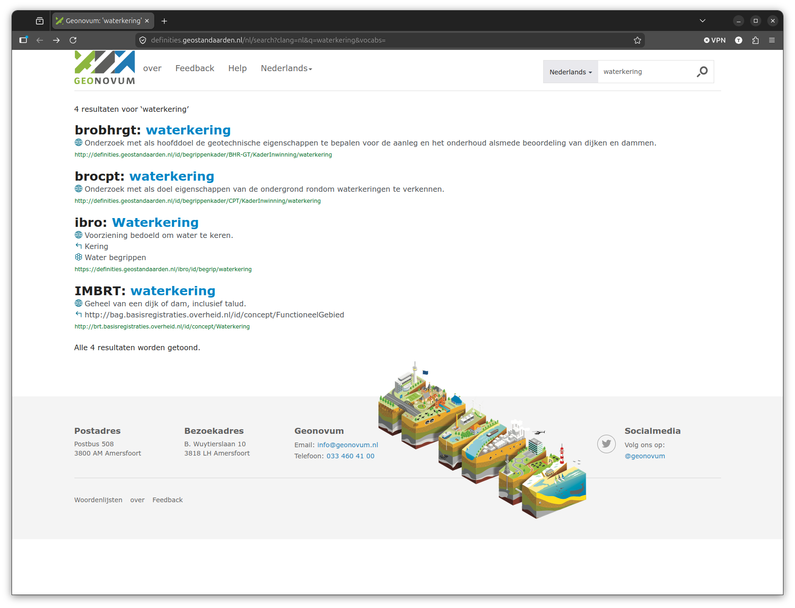
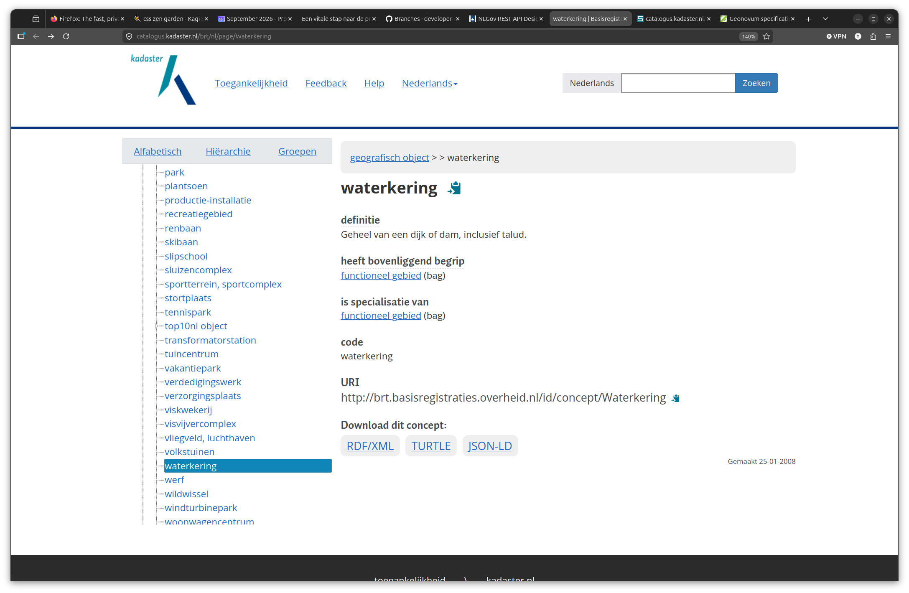
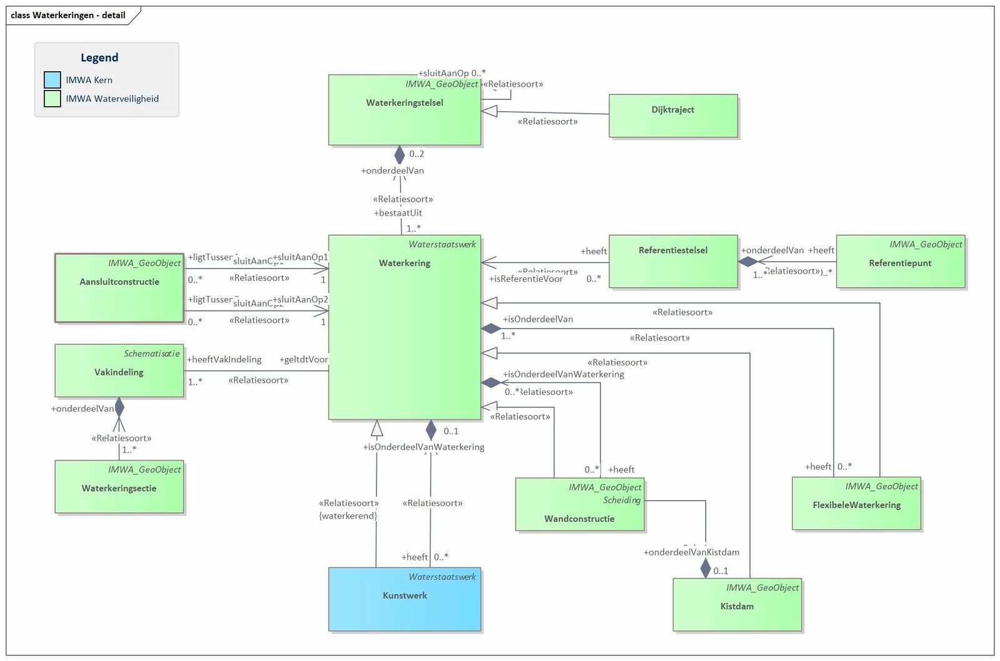
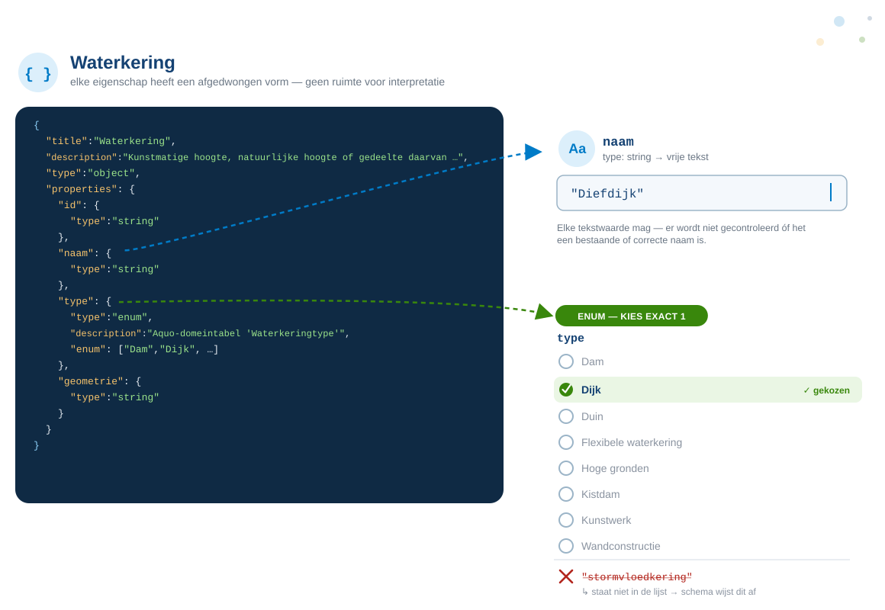
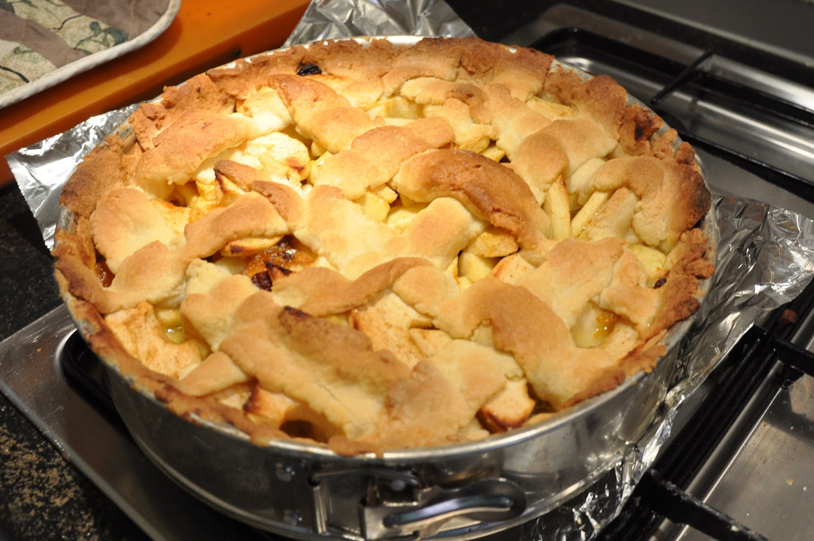
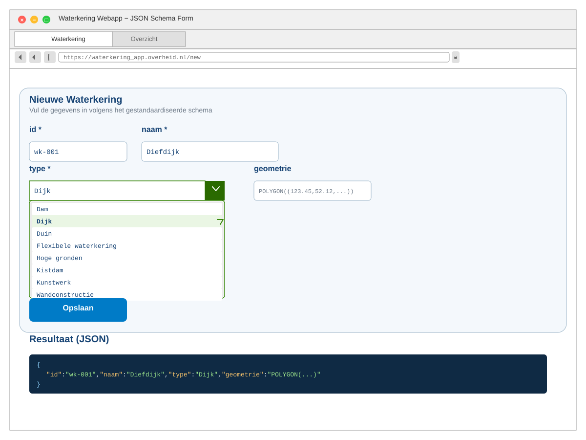

# Een vitale stap naar de praktijk: developer tooling voor standaarden

<!-- <p style="text-align: center; max-width: 60%; margin: 0 auto;">En waarom we veel meer moeten investeren in developertooling voor standaarden</p> -->

<!-- _class: title invert -->

<ul class="horizontal-list" style="margin-top: 3rem;">
  <li>Tom Ootes</li>
  <li>🐘 <a href="https://social.codefor.nl/@tomootes">@tomootes</a></li>
  <li>20 jaar Forum Standaardisatie</li>
  <li>21 september 2026</li>
</ul>

<!--

Dankjewel Maurice. Ik wil graag inhaken op wat je eerder noemde, de standaard meetmethoden. 
In het geval van mijn doelgroep, developers is dat namelijk een nog logischere stap dan in andere vakgebieden.
In ons geval heten die meetinstrumenten eerder "tools" of "linters" of "checkers".
Ik ga de rest van deze presentatie gebruiken om uit te leggen hoe developers werken en wat we daarvan kunnen 
leren als het gaat om de compliance van standaarden.

-->

## whoami?

<!-- _class: invert -->

<div class="two-columns">
  <ul>
    <li>Tom Ootes</li>
    <li>Developer.overheid.nl (2023)</li>
    <li>Open Source, Developer Advocate</li>
    <li>Community, outreach</li>
  </ul>
  <div>
    
  </div>
</div>

<!--
Kort eerst iets over mijzelf.

Ik ben Tom, werk al sinds 2023 aan developer.overheid.nl. Als freelancer 
veel verschillende overheidsprojecten gedaan. Vind het mooi om daar aan te 
werken omdat we met developer.overheid.nl een gemeenschappelijk platform 
hebben om developers op een-duidige manier software te laten bouwen.

Mijn rol is developer advocate wat betekent dat ik me verdiep in wat developers
nodig hebben om bijvoorbeeld compliant te kunnen worden aan een standaard.

-->


## developer.overheid.nl


<!-- _class: invert -->

<!-- ## **Dev questions:**

- Code style (linters)?
- Assess OS libraries?
- Interpret policies?
- Co-operate?
- What OS resources are available?
- Which tools?
- Become compliant with government standards? -->


## Een developer werkt en denkt

- Iteratief, snel
- Met machine leesbare bestandsformaten (HTML, Python, Markdown, YAML)
- Pragmatisch en doelbewust
- Gebruikt herhalende scripts om code te checken

## Machine leesbaar?

<!-- _class: invert -->

```html
<!DOCTYPE html>
<html lang="nl">
<head>
  <title>Pagina over de Diefdijk in Culemborg</title>
</head>
<body>
  <h1>De Diefdijk</h1>
  <table>
    <thead>
      <tr>
        <th>Categorie</th>
        <th>Gemeente</th>
        <th>Type</th>
    <tbody>
      <tr>
        <td>Waterkering</td>
        <td>Culemborg</td>
        <td>Dijk</td>
      </tr>
    </tbody>
  </table>
</body>
</html>
```

## 

<!-- _class: invert -->


## Spellingcheck

Je kan het zien als een <span class="spell-error">spelligncheck</span> die constant checkt of 
je tekst wel in orde is.


## Internet.nl: domain check

<!-- _class: invert -->


## API Design Rules checker

<!-- _class: invert -->


<!--

* Niet ingaan op materie API
- Laten zien dat de code gecheckt wordt op de standaard
- Direct feedback

-->


## Het haakje: linters en checkers als meetinstrumenten

- Checken is voor veel standaarden handwerk
- Dit is niet iets wat developers developertooling
- Vertrouwen leggen in tooling (internet.nl) 
- Samen beter maken

## Vaak mist er developer tooling

- Hier ligt een enorme kans
- Direct compliant
- Vitaal voor de adoptiegraad

<!--
- Grote investeringen in standaarden
- Adoptiegraad blijft achter
- Voorbeeld van een appeltaart/ hoeveelheid zout
-->

## Casus: ik ga een website bouwen waarbij ik het concept "Waterkering" moet vastleggen

> **Waterkering**
> Kunstmatige hoogte, natuurlijke hoogte of gedeelte daarvan, 
> of hoge gronden met ondersteunende kunstwerken, die een waterkerende
> of mede een waterkerende functie hebben.
> ~ Aquo-standaard

<!-- 
  Kan via UML
  Maar: foutgevoelig
  Help developers: machine leesbaar formaat  
-->

## Vraag aan jullie: welke typen waterkeringen zijn er?

## Deze typen waterkeringen zijn er:
* Dam
* Dijk
* Duin
* Flexibele waterkering
* Hoge gronden
* Kistdam
* Kunstwerk
* Wandconstructie

## 



## 



## LINKED Data



## Dus, UML maar ook een JSON Schema.

<!-- _class: invert -->


## Voorbeeld: Schema Waterkering



## Als koken zonder recept



<!--
Bron enum-waarden: Aquo-domeintabel "Waterkeringtype" (Dam, Dijk, Duin, Flexibele
waterkering, Hoge gronden, Kistdam, Kunstwerk, Wandconstructie) — dezelfde typen die
ook als losse klassen in de UML-diagram (slide "Casus: Waterkering") voorkomen.
Gekozen voorbeeld: "Dijk" / naam "Diefdijk", consistent met het JSON-LD-voorbeeld verderop.
-->

## Met AI; sturing (zijwieltjes) hard nodig

<!-- 
Goedkoper
Hallucineert minder.

-->

## Conforme apps bouwen



<!-- 
## Waarom is het nodig dat de architecten JSON Schema zelf gaan bouwen?
UML moet altijd geintrpeteerd worden om naar JSON SChema te gaan. 
-->

<!-- We kunnen eindelijk makkelijk API's / bronnen bouwen met deze data. -->

## Dus: investeer in developer tooling

- Developer tooling zou een vereiste moeten zijn voor de "pas-toe-leg-uit" lijst
- Laten we hierin investeren
- De brug slaan naar de praktijk

## Bedankt! 

Vragen?

🐘 [@tomootes](https://social.codefor.nl/@tomootes)
📬 t.ootes@geonovum.nl