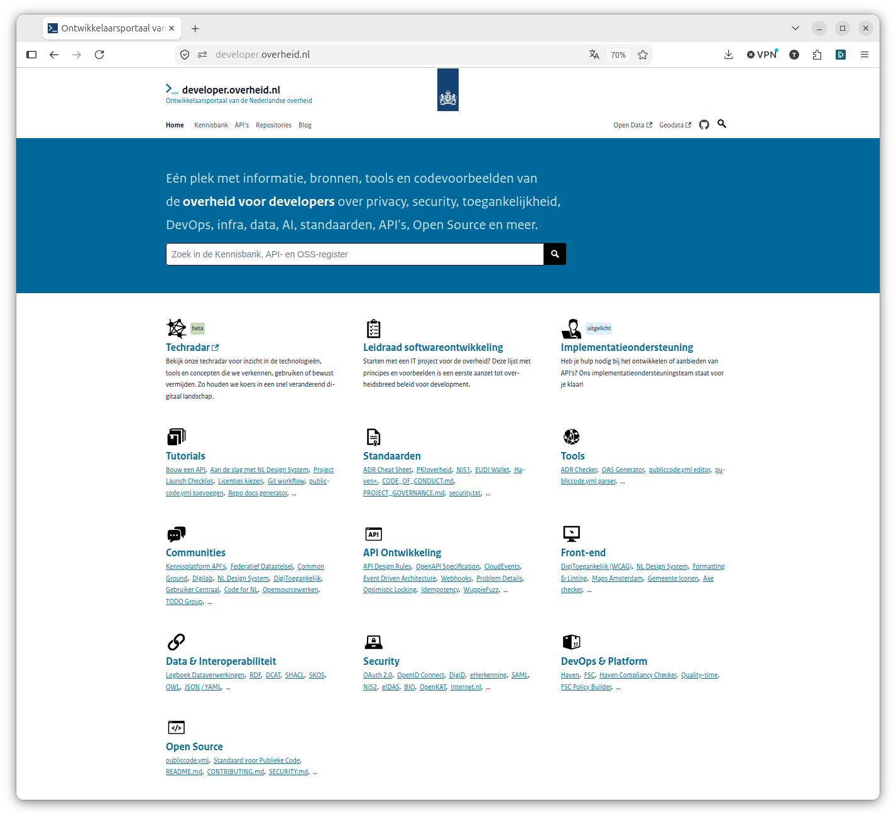
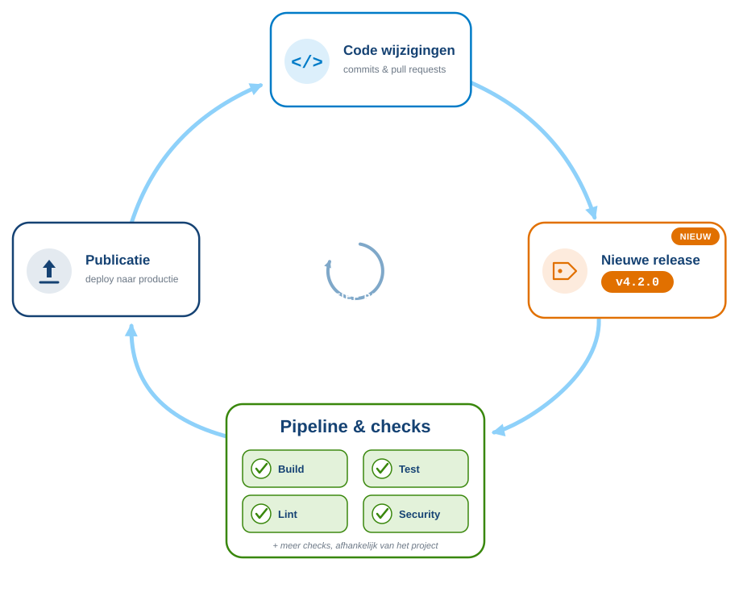
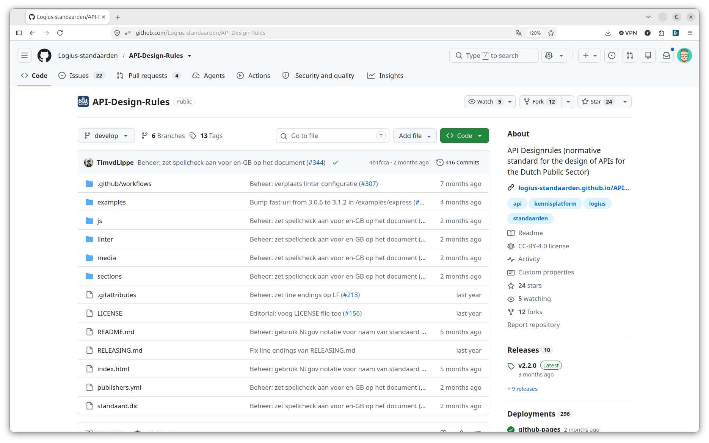
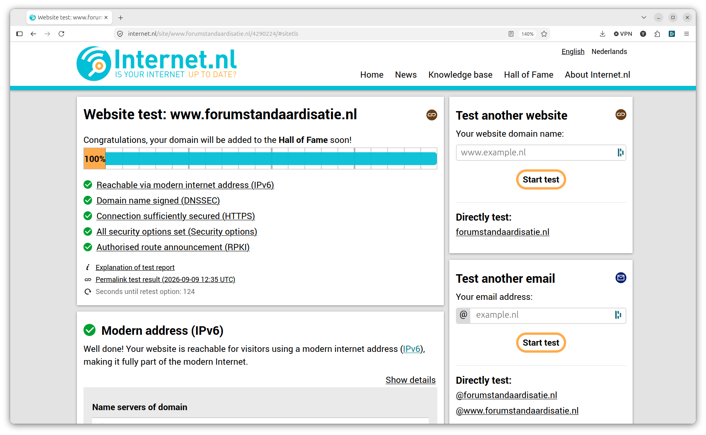
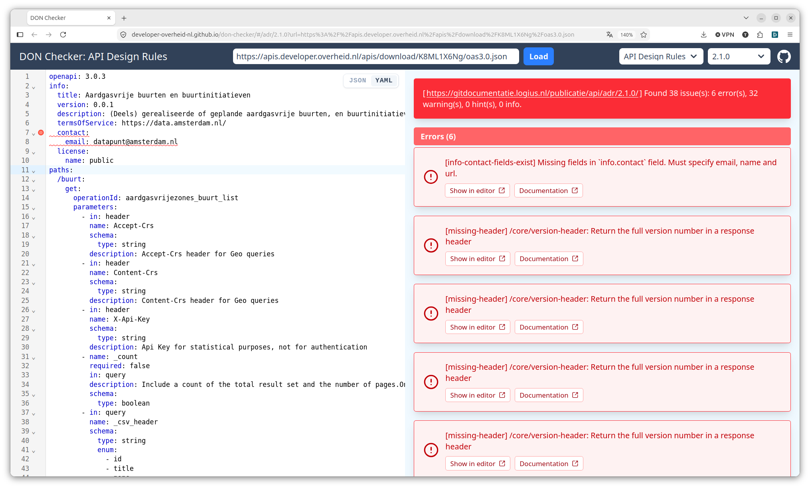
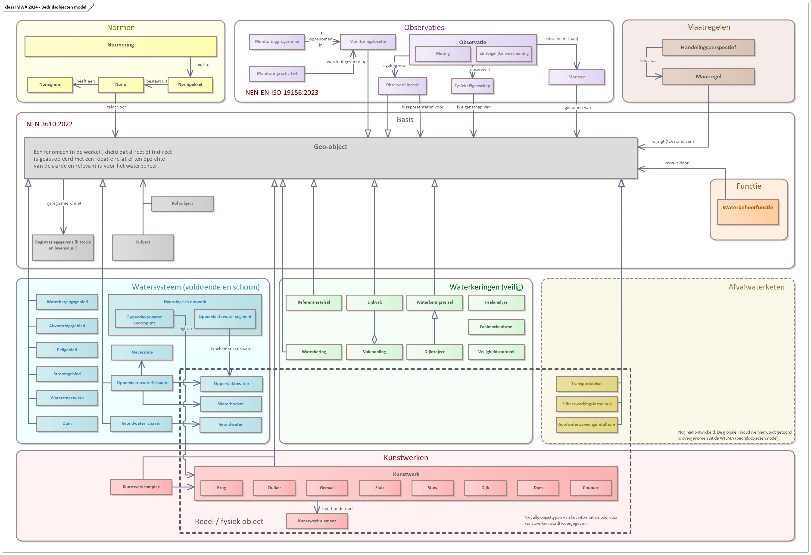
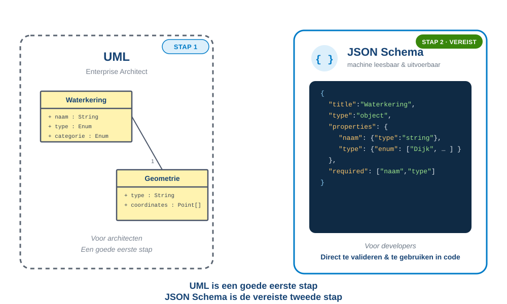

# Developers hebben tools nodig

En waarom we veel meer moeten investeren in developertooling voor standaarden

<!-- _class: title invert -->

<ul class="horizontal-list" style="margin-top: 3rem;">
  <li>Tom Ootes</li>
  <li>🐘 <a href="https://social.codefor.nl/@tomootes">@tomootes</a></li>
  <li>20 jaar Forum Standaardisatie</li>
  <li>21 september 2026</li>
</ul>

<!--

Dankjewel Maurice. Ik wil graag inhaken op wat je eerder noemde, de standaard meetmethoden. 
In het geval van mijn doelgroep, developers is dat namelijk een nog logischere stap dan in andere vakgebieden.
In ons geval heten die meetinstrumenten eerder "tools" of "linters" of "checkers".
Ik ga de rest van deze presentatie gebruiken om uit te leggen hoe developers werken en wat we daarvan kunnen 
leren als het gaat om de compliance van standaarden.

-->

## whoami?

<!-- _class: invert -->

  <ul>
    <li>Tom Ootes</li>
    <li>Developer.overheid.nl (2023)</li>
    <li>Developer Advocate</li>
    <li>Community/ outreach</li>
  </ul>
  

    
  

<!--
Kort eerst iets over mijzelf.

Ik ben Tom, werk al sinds 2023 aan developer.overheid.nl. Als freelancer 
veel verschillende overheidsprojecten gedaan. Vind het mooi om daar aan te 
werken omdat we met developer.overheid.nl een gemeenschappelijk platform 
hebben om developers op een-duidige manier software te laten bouwen.

Mijn rol is developer advocate wat betekent dat ik me verdiep in wat developers
nodig hebben om bijvoorbeeld compliant te kunnen worden aan een standaard.

-->

## developer.overheid.nl

<!-- _class: invert -->

<!-- ## **Dev questions:**

- Code style (linters)?
- Assess OS libraries?
- Interpret policies?
- Co-operate?
- What OS resources are available?
- Which tools?
- Become compliant with government standards? -->

## Een developer werkt

- Iteratief, snel
- Met machine leesbare formats (HTML, Python, Markdown, YAML)
- Pragmatisch en doelbewust
- Gebruikt herhalende scripts

## 

<!-- _class: invert -->

## Bron is beschikbaar (open source)

<!-- _class: invert -->

## Het haakje: linters en checkers als meetinstrumenten

## Internet.nl: domain check

<!-- _class: invert -->

## API Design Rules checker

<!-- _class: invert -->

## Mijn punt: vaak mist er developer tooling

- Enorme gemiste kans
- Direct compliant
- Grotere kans dat er uberhaupt adoptie plaats vindt

## Grote kansen: binnen informatie modellen

- Ontworpen door architecten
- Ontoegankelijk voor developers
- Samen de laatste horde nemen

## Een voorbeeld: Aquo

"De Aquo-standaard (Aquo) is dé Nederlandse standaard voor de efficiënte en geautomatiseerde uitwisseling van waterdata.

De Aquo-standaard is ontwikkeld en wordt beheerd door het Informatiehuis Water."

- Zeer goed gedocumenteerd
- UML / Enterprise Architect

<!-- - Alles is verschrikkelijk goed gedocumenteerd. Maar waarin? UML en Enterprise Architect.  -->
<!-- - Alles is super nauwlettend vastgesteld. Maar niet in de taal van de developers. -->

## Informatiemodel Water (IMWA)

## Casus: ik wil een "Waterkering" vastleggen in een database

- Nodig: machine leesbaar formaat
- Kan via UML
- Maar: foutgevoelig

## Dus, UML maar ook een JSON Schema.

<!-- _class: invert -->

## Voorbeeld: Schema

TOon op deze slide het hele schema

## Met AI; guardrails hard nodig

## DUS: Investeer in developer tooling

- Laten we samen deze laatste horde nemen
- Om te zorgen dat de implementatie graden te laten stijgen!!~

