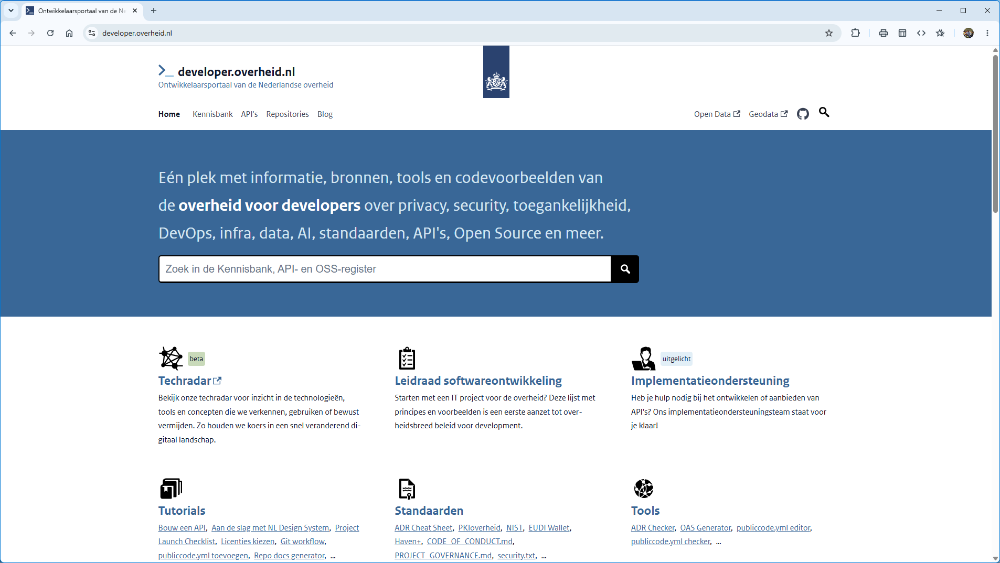
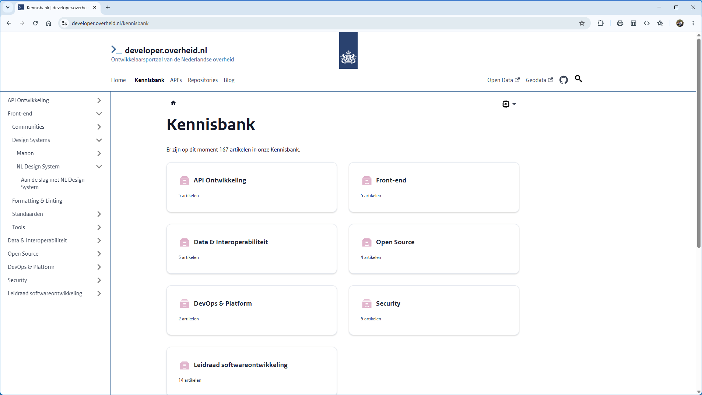
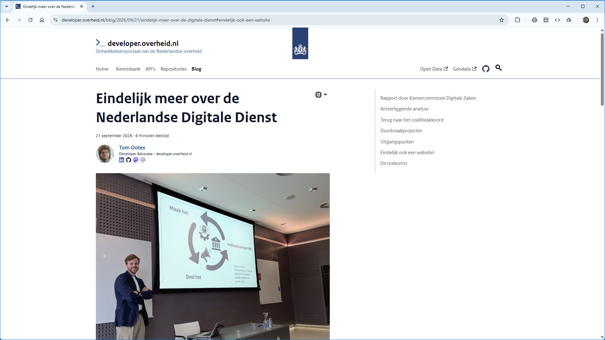
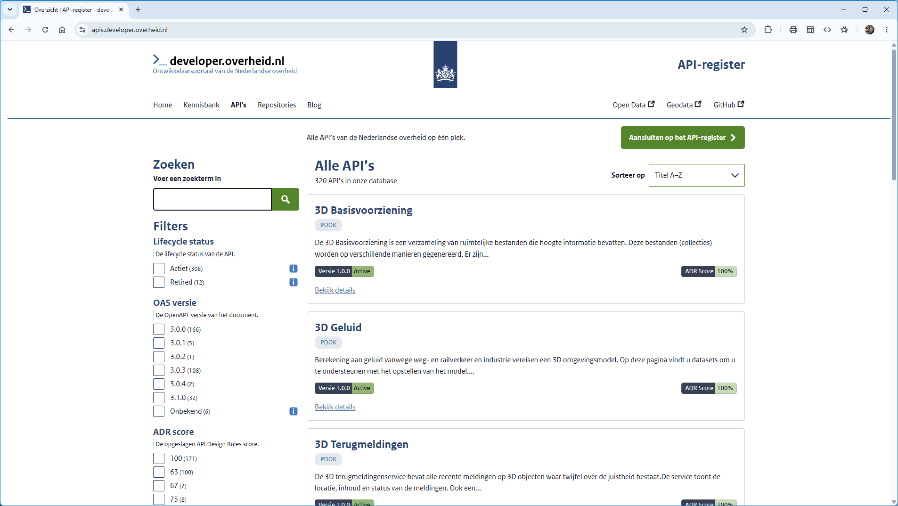
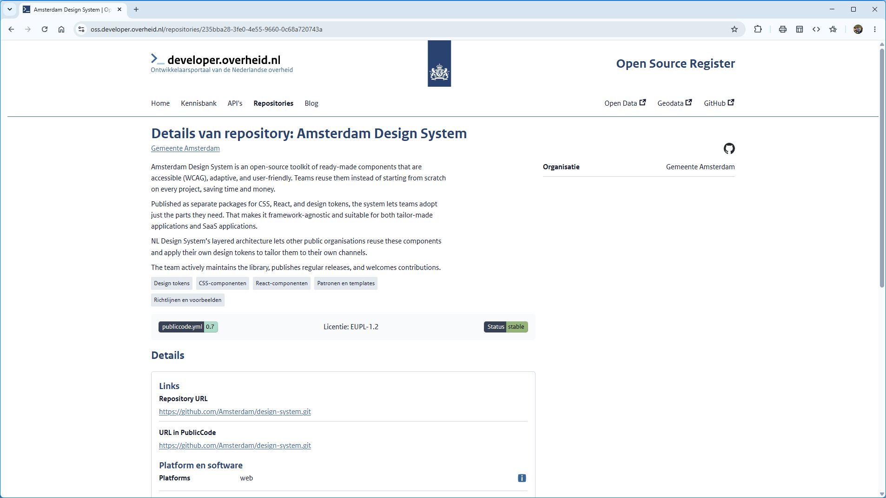
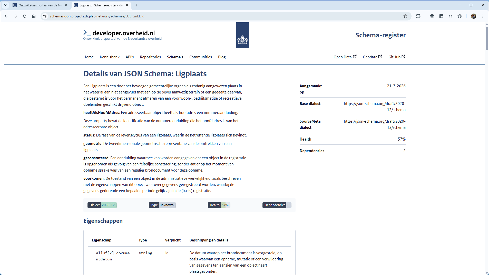

# Componenten voor `developer.overheid.nl`

<!-- _class: title -->

- Jaap-Hein Wester
- **NL Design System Heartbeat**
- 13 Oktober 2026

## **`whoami`**

<!-- _class: split -->

- 🦘 Jaap-Hein Wester
- 👨🏻‍💻 Front-end developer
- 🖥️ `developer.overheid.nl`
- <a href="https://github.com/MrSkippy">@MrSkippy</a> op GitHub

## Wie zijn we?

<!-- _class: image image--full -->

<!-- 
Wat is developer.overheid.nl?

We zijn het ontwikkelaarsportaal van de Nederlandse overheid. 
-->

## Wat doen we?

<!-- _class: image image--split -->

 

<!--
We bieden een centrale plek voor developers om informatie te vinden, dat doen we door middel van o.a. een kennisbank, blog en tools.
-->

## Registers

<!-- _class: image image--stack -->

  

<!--
Daarnaast bieden we registers aan voor API's en Open Source repositories van overheidsorganisaties.
-->

## Setup

### Kennisbank

- 🦖 Docusaurus, Typesense search
- ✨ Rijkshuistijl Community components

### Register sites

- 🚀 Astro
- ⚛️ React, Vite, Typescript
- Register Site Components 🔛 Rijkshuistijl Community components

<!--
De kennisbank is gebouwd met Docusaurus met daarin wat Rijkshuistijl Community components sprinkled in.

De register sites zijn gebouwd met Astro, React, Vite en Typescript. Ook hier gebruiken we Rijkshuistijl Community components.
Maar we hebben ook een aantal eigen componenten gemaakt. Dit geheel wordt vanuit de don-components package gebruikt.
-->

## Register Site Components

Waarom hebben we een eigen package voor componenten?

- Unieke componenten
- Aangepaste componenten
- Upgrade compatibiliteit naar derde partijen

<!-- 
Voor de register sites hebben we regelmatig componenten nodig die niet in de Rijkshuistijl Community componenten voorkomen of waar we een eigen variant van willen hebben. 

De boel is opgezet zodat een andere partij zijn eigen register kan bouwen met onze packages. Om incompatibiliteit te voorkomen hoeven ze alleen onze packages te installeren.
-->

## Storybook

<!-- _class: centered -->

<a class="external" target="_blank" href="https://developer-overheid-nl.github.io/don-register-site/">Demo time!</a>

<!-- 
* Opens storybook *
-->

## Vragen?

<!-- _class: clean -->

## 🫳🏻🎤⤵️

<!-- _class: centered -->

<!-- 
* Drops mic... *
-->
