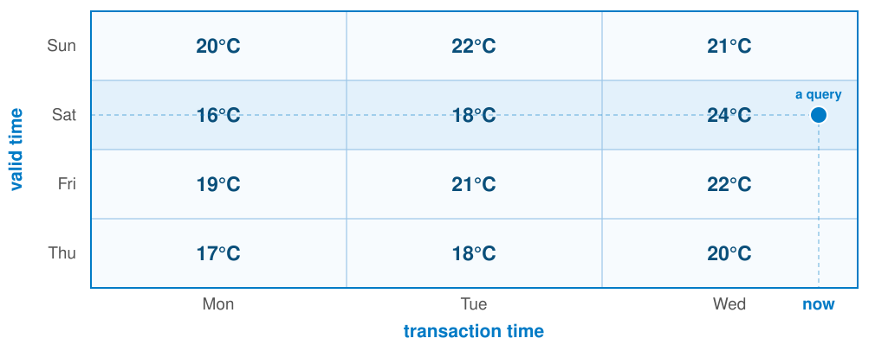

# The Temporal Side of APIs

<!-- _class: title -->

<ul class="horizontal-list" style="margin-top: 3rem;">
  <li>Joost Farla</li>
  <li><a class="linkedin" href="https://www.linkedin.com/in/joostfarla">joostfarla</a></li>
  <li>Apidays Amsterdam · 2026-06-09</li>
</ul>

<!--
- Lightning talk, ~20 min. One thesis, three patterns. Move fast.
- Open cold: say the title, let it breathe.
- Then quick hello. Next two slides: who I am, why this talk.
- Then the one claim that runs through everything.
≈0:00
-->

## Joost Farla

- I work on **API and data standards** at **Geonovum**
- Active contributor of Kennisplatform API's
- Implementation advisor for **standards adoption**
- Co-founder of ModelDesk (data modeling platform)

<!--
- Quick hello. API + data standards at Geonovum (Dutch public sector).
- My world: public registers. Systems of record for property, people, money.
- Perfect lens: used by everyone, and getting history wrong is expensive (sometimes in court).
- So: I think about temporal data for a living.
≈0:20
-->

## Where this comes from

Dutch public registers are transitioning off **ebMS2** and **StUF**, a decades-old SOAP/XML message standard, onto modern **REST APIs**.

- Those standards did history **well**: bitemporal, correctable, exactly-once.
- They are end-of-life, and the modern baseline is **REST/HTTP**.
- We are starting a **working group on history**: keep the rigor, drop the legacy.

<div class="highlight warning">
The hard part is not REST. It is keeping what the old standards already got right.
</div>

<!--
- Why this talk: registers run on ebMS + StUF, decades-old SOAP/XML.
- The twist: those old standards are GOOD at exactly this:
  bitemporal history, corrections, exactly-once.
- But end-of-life; the modern baseline is REST.
- Danger: treat REST as a clean slate, throw the rigor away. (REST defaults to "now".)
- So: working group on history. Keep the rigor, drop the legacy.
- SAY CLEAN: "almost every API knows only one word, and that word is 'now'."
≈0:45
-->

# Most APIs only know **now**.

<!-- _class: title -->

<!--
- The thesis. Say it, let it land. Then click on.
- CRUD = an eternal present. GET = current state; PUT overwrites yesterday with today.
- The world is not one state: it has history, validity, and a separate question:
  when did we know that? Hold it; it is the whole talk.
≈1:20
-->

## You've felt it

- You can `git blame` any line of code: what it was, when, why.
- Try that on a row in your database.
- There is no blame. There is only now.

<div class="highlight warning">
Our code remembers everything. Our data remembers nothing.
</div>

<!--
- You have felt this lie, even if you never named it.
- git blame: any line of code = what, who, when, why.
- Try that on a DB row: no blame. Column holds today; the past is gone.
- SAY CLEAN: "our code remembers everything; our data remembers nothing."
- Same pain, other faces: report will not reproduce, audit cannot explain a past decision.
- The plan: make your data behave like git.
≈2:00
-->

## To retain history, we need two timelines

| valid time                     | transaction time        |
| ------------------------------ | ----------------------- |
| _when it's true_ in the world  | _when we recorded_ it   |
| forecast: **the day it's for** | **the day it was made** |

These two are **independent**. This is called **bitemporal**.

<!--
- The fix: every fact lives on two timelines, not one.
- Weather forecast: valid time = day it is about (Sat); transaction time = when recorded (Mon).
- Re-forecast Wed: same Sat, new record. Same valid time, new transaction time. Independent.
- They come apart often: backdated fix (record last year today); future-dated change (price starts next month).
- Value dates, effective dates, created-at: all the same two timelines.
- Two is enough. A third exists (decision time), but start here.
≈3:30
-->

## A query is a point on a plane



Every box is a belief: a day, as recorded at a moment. **A query lands in one.**

<!--
- Two timelines on two axes = a plane.
- Side = valid time (upcoming days forecast). Bottom = transaction time (day each forecast recorded).
- Each box = a belief: the forecast for that day as held at that moment.
- Every box is a future day, so each row = same day, re-forecast.
- Sat row: 16 Mon, 18 Tue, 24 Wed. Forecast for Sat changing each day.
- A query = one point (which day, as known when). Lands in exactly one box.
- Notice "now": just the rightmost column. One coordinate among many.
≈5:00
-->

## Writes assert. Reads project.

| Write                                  | Read                             |
| -------------------------------------- | -------------------------------- |
| append a fact ("as of now, X is true") | ask for the view at a moment     |
| never overwrite                        | coordinates: validAt, recordedAt |

<div class="highlight warning">
One CRUD resource treats these as one job. They are two.
</div>

<!--
- Two coordinates, so read and write are two different jobs.
- Write = not "set value to X". It is "as of now, I assert X". You append.
- Read = not "give me the value". It is "give me the view at a moment". You project.
- Plain CRUD collapses both into one GET/PUT resource. Only works if you pretend one current state: the lie.
- Roadmap: Pattern 1 = write side, Pattern 2 = read side, Pattern 3 = writes safe over the network.
≈6:30
-->

# Three patterns

<!-- _class: title -->

## Pattern 1: Append, don't overwrite

`PUT` is the original sin: it overwrites the past, and **you can never get it back**.

- Don't mutate in place. Add a **version**.
- Every version stays addressable, forever.
- "Delete" = assert _closed as of_, never erase.

<!--
- Pattern 1, the write side.
- Overwrite = past gone for good, never reproducible. So stop.
- A write = new immutable version. Old versions keep their URLs.
- "Delete" = a fact too: "closed as of T". A tombstone, not an erasure.
- Sounds heavy? You already trust git: it never rewrites, it appends and points.
- We just bring that discipline to your data.
≈8:00
-->

## Pattern 1: On the wire

<pre class="wire"><code>PUT   /properties/8400               # overwrite, history lost     <span class="bad">✗</span>
POST  /properties/8400/valuations    # record a new valuation      <span class="ok">✓</span>
GET   /properties/8400/valuations/7  # past valuations: still there</code></pre>

Versions can also be used as concurrency tokens:
`If-Match: "v7"` → **412** if it already moved to v8.

<!--
- Same idea on the wire.
- PUT replaces and loses history: drop it. POST appends instead.
- Each valuation = stable id + own URL. Old ones fetchable forever.
- Bonus: optimistic concurrency, free. Version id doubles as ETag.
- If-Match: "v7". If someone wrote v8 already, server returns 412 instead of clobbering.
- Safe concurrent writes, no locks.
≈9:30
-->

## Pattern 1: Fixing a mistake

Never edit, never delete. Append a version that **supersedes** the wrong one.

```http
# v7 had the wrong amount.

POST /properties/8400/valuations
{ "supersedes": "v7", "validFrom": "2022-01-01", "amount": 412000 }
```

v7 stays on record, superseded by v9, like a git commit naming its parent.

<div class="highlight warning">
You can fix the past without erasing it.
</div>

<!--
- The question everyone asks: how do you fix a mistake?
- Do not edit. Append a correction that supersedes the old version, by id.
- Why by id, not date? The date can be the mistake (v7 had the wrong validFrom). Id is the only stable handle.
- v7 never deleted: stays, marked superseded by v9. Like a git commit naming its parent.
- Trail shows: what you believed (v7), the correction (v9), when each happened.
- Pair with If-Match: "v7". 412 if someone already superseded it.
- SAY CLEAN: "you can fix the past without erasing it."
≈10:15
-->

## Pattern 2: Read at a moment

Read the data **as it stood** at any moment, not only now.

- Two timelines → **two query params**.
- Same coordinates → **same data, forever**. (The **repeatable question**.)
- Think: the Wayback Machine, for your data.

<!--
- Pattern 2, the read side. The feature people fall in love with.
- Make the moment you read from an explicit input, not always "now".
- Pin the coordinates: the answer never changes. Not next week, not in five years.
- The repeatable question. Gold for audit, debugging ("what did it return last Tuesday"), reproducible reports, ML training sets.
- Frame: the Wayback Machine, for your own data.
≈11:00
-->

## Pattern 2: On the wire

```http
GET /rates/usd-eur                         # → now / latest
GET /rates/usd-eur?validAt=2023-06-01      # value on that day
GET /rates/usd-eur?validAt=…&recordedAt=…  # a point on the plane
```

A past snapshot can never change, so:
`Cache-Control: public, max-age=31536000, immutable`

<!--
- On the wire: just two query params.
- validAt = point on valid timeline. recordedAt = point on transaction timeline.
- Set one: slide along an axis. Set both (line 3): one named point = the dot on the plane.
- Leave both off: default to "now". Behaves like the boring API everyone expects.
- "now" is the default coordinate, not the only one.
- Bonus: a past snapshot is immutable, so infinitely cacheable. Mark it immutable, a CDN holds it forever.
- Temporal design and caching are friends.
≈12:30
-->

## Pattern 3: The network has no "now" either

You `POST` a payment. The connection times out.

**Did it land?** You have no idea.

- Retry blindly → maybe a double charge.
- A timeout is _ambiguous_, by nature.

<!--
- Pattern 3. Time in the data is done; now time in the protocol.
- Between "request sent" and "response received": a gap. You do not know the outcome.
- POST a payment, connection times out: did it land? No idea.
- Retry blindly: maybe a double charge.
- A timeout is not failure. It is unknown.
- If writes are not safe to retry, every flaky connection adds duplicates to your append-only log.
≈14:00
-->

## Pattern 3: Make writes safe to retry

```http
POST /payments
Idempotency-Key: 7b2c-…-e9
{ "amount": 5000, "currency": "eur" }

# timeout → retry, SAME key:
POST /payments
Idempotency-Key: 7b2c-…-e9      # → 200, the original payment
```

Exactly-once _delivery_ is impossible. Exactly-once **effect** is not.

<!--
- The fix: an idempotency key.
- Client mints one unique key per intended operation.
- Server stores the result against the key, replays it on any retry.
- Same key, same payload, same payment. No double charge. (The Stripe pattern.)
- SAY CLEAN: "exactly-once delivery is impossible; exactly-once effect is not."
- That effect is what everyone actually wanted.
≈15:30
-->

## A few gotchas

- **Server stamps transaction time.** Never trust the client's clock.
- **UTC on the wire.** Time zones are a presentation concern.
- **Corrections ripple.** A backdated fix changes answers downstream; tell your subscribers.
- **Immutable history vs. "right to be forgotten".** Withdraw it logically, keep it for audit. Crypto-shred only when you must truly erase.

<!--
- Rapid fire, the things that bite.
- Server owns transaction time. Client clocks lie and skew: never trust them.
- UTC on the wire. Localize only at the edge.
- Corrections ripple: a backdated fix makes cached answers wrong. Webhooks must announce "this past value changed".
- GDPR vs append-only: withdraw the record logically, keep the bytes for audit.
- Crypto-shred (encrypt per subject, destroy the key) only when you must truly erase.
≈17:00
-->

## Takeaways

- **"Now" is a default, not the only coordinate.**
- **Append, don't overwrite; history is a feature, not exhaust.**
- **Two timelines → two params:** `validAt`, `recordedAt`.
- **Make every write safe to retry:** `Idempotency-Key`.
- **Time is an axis. Put it in the contract.**

<!--
- Pull the thread together.
- One thing: stop letting "now" be the only moment your API can talk about.
- Append, not overwrite. Read at a chosen moment (validAt, recordedAt). Make every write safe to retry.
- Then reproducibility, audit, safe retries stop being bolt-ons. You get them for free.
- SAY CLEAN: "time is an axis; put it in the contract."
≈18:30
-->

## Thank you

<!-- _class: title -->

<h3 class="pt-0">Questions?</h3>

<p class="mb-0">📩 j.farla@geonovum.nl</p>
<p class="mb-0"><a class="linkedin" href="https://www.linkedin.com/in/joostfarla">joostfarla</a></p>

<div class="feedback">
  
  <span>Feedback?</span>
</div>

<!--
Q&A buffer. Likely questions to have answers ready for:
- "Isn't this just event sourcing?" → it's the storage substrate; the
  talk is about exposing it in the contract. You can do bitemporal on a
  plain RDBMS with SQL:2011 temporal tables.
- "Performance of as-of reads?" → immutable snapshots cache forever;
  index on both time axes; most reads are still 'now'.
- "Do I need this everywhere?" → no. Reach for it where reproducibility
  or audit matters: money, health, legal, valuation.
- Vocabulary for defense: valid time, transaction time, bitemporal,
  as-of, effective dating, optimistic concurrency, idempotency key.
≈20:00
-->
