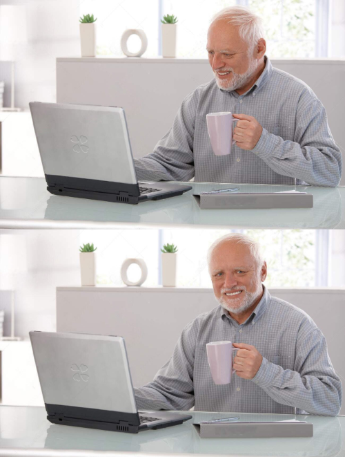
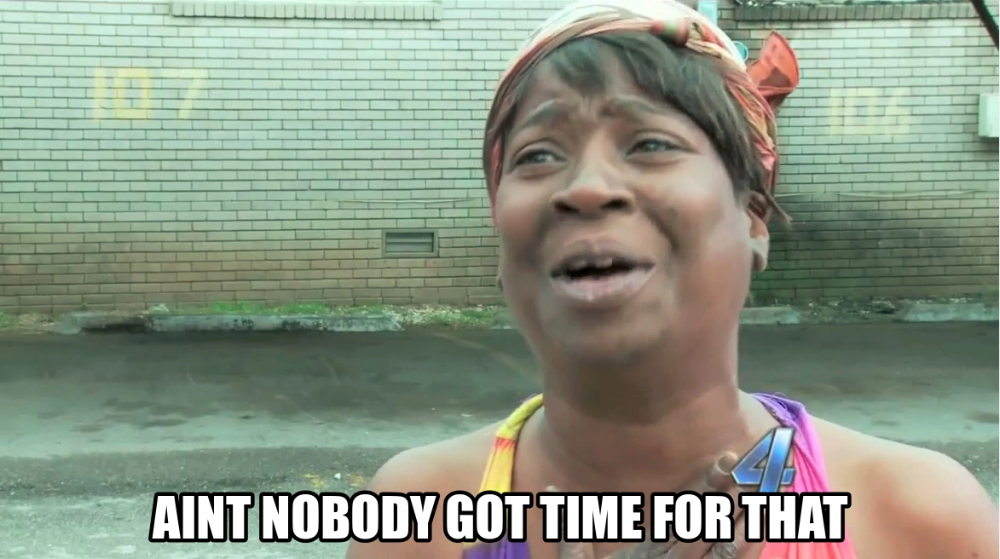

# TWEAKERS DEV SUMMIT

<!-- 
En waarom we veel meer moeten investeren in developertooling voor standaarden
 -->

<!-- _class: title invert -->

<ul class="horizontal-list" style="margin-top: 3rem;">
  <li>Tom Ootes</li>
  <li>🐘 <a href="https://social.codefor.nl/@tomootes">@tomootes</a></li>
  <li>20 jaar Forum Standaardisatie</li>
  <li>21 september 2026</li>
</ul>

In deze presentatie wil ik jullie graag meenemen in een realisatie die ik heb
opgedaan tijdens mijn werk afgelopen jaren. Ik begon als developer die wars was
van conventies en linters, het voelde alsof mij iets werd opgelegd terwijl
niemand mij kon uitleggen waarom dat precies zo was.

De afgelopen jaren ben ik standaarden gaan zien als een manier van samenwerken,
van afspraken die je maakt als je bijvoorbeeld een API bouwt of een front-end.
Ik zie het als een manier voor onze overheid om eindelijk wat meer eenduidig te
developen, maar ook als een manier om instructies mee te geven aan LLM's zodat
coding agents niet uit de bocht vliegen. In die zijn worden standaarden steeds
belangrijk.

<!--

-->

## whoami?

<!-- _class: invert -->

  <ul>
    <li>Tom Ootes</li>
    <li>Developer.overheid.nl (2023)</li>
    <li>Open Source, Developer Advocate</li>
    <li>Community, outreach</li>
  </ul>
  

    
  

<!--
Kort eerst iets over mijzelf.

Ik ben Tom, werk al sinds 2023 aan developer.overheid.nl. Als freelancer
veel verschillende overheidsprojecten gedaan. Vind het mooi om daar aan te
werken omdat we met developer.overheid.nl een gemeenschappelijk platform
hebben om developers op een-duidige manier software te laten bouwen.

Mijn rol is developer advocate wat betekent dat ik me verdiep in wat developers
nodig hebben om bijvoorbeeld compliant te kunnen worden aan een standaard.

-->

## Agenda

<!-- _class: invert -->

- developer.overheid.nl
- mijn ervaringen met standaarden
  - ADR
  - Publiccode.yml / solving Open Source catalogs

## developer.overheid.nl

## Mijn ervaring

Tijdens mijn werkzaamheden bij developer.overheid.nl kwam in aanraking met
verschillende standaarden. Er zijn verschillende thema's waarop onze overheid
beter wil worden:

- Accessibility (WCAG)
- Security
- Data delen (API's, Informatiemodellen)

### Pas toe leg uit - lijst

Hier ga ik iets vertellen over de PTOLU lijst.

## Over de API Design Rules

Dit is een open standaard die we samen met de gehele overheid vormgeven. Het
beschrijft hoe een een HTTP/REST API er uit zou moeten zien, hoe de endpoints
zouden moeten functioneren.

Iedereen die er iets van vind kan een PR inschieten.

## Een les die we leerden

Van PROD naar Open API Specification

## Wat voor problemen het kan oplossen

De Nederlandse overheid is een gedecentraliseerd geheel waarbij elke organisatie
zelf verantwoordelijk is voor de uitvoering van haar IT. Ik zie dit op korte
termijn ook niet snel veranderen.

## Dus hoe krijgen we die standaaarden aan de man?

Goede tooling aanbieden! Dit is ook onze filosofie bij developer.overheid.nl.

## API Design Rules

Screenshot van de RESPEC van de API Design Rules.

Binnen de overheid hebben we tal van standaarden die verschrikkelijk goed
gedocumenteerd zijn.

## De rules!

NOICE TABLE WITH:

technical rules // and functional rules

## Focus op CI/CD

Onze tools kan je uiteraard in je Github/ Gitlab/ Forgejo pipeline hangen.

En ik weet wel, als developer ben je vooral dingen aan het oplossen. Developers
zijn niet van nature mensen die de documentatie erbij pakken en er even goed
voor gaan zitten.

## AINT NOBODY GOT TIME FOR THAT

## Tooling!

Maar inmiddels hebben we prachtige tooling. Ik moedig iedereen aan o

## Bedankt!

Vragen?

🐘 [@tomootes](https://social.codefor.nl/@tomootes) 📬 t.ootes@geonovum.nl
