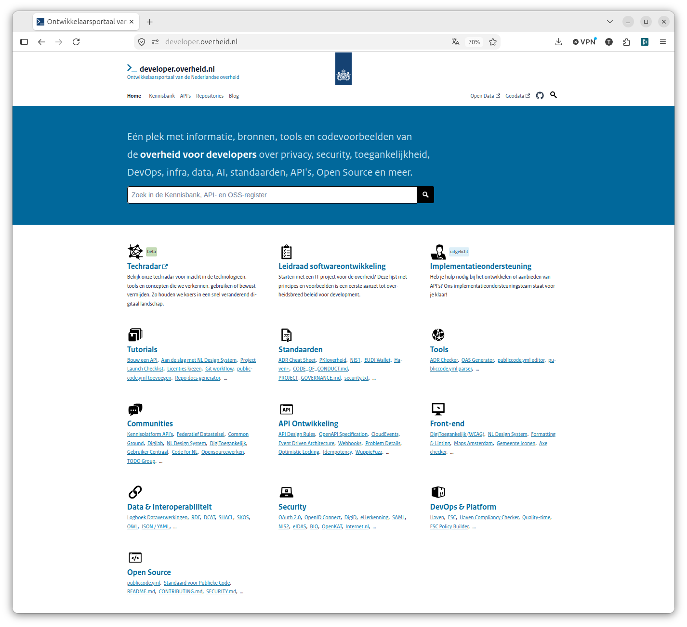
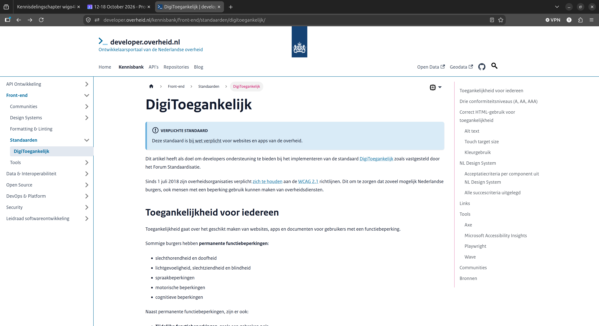
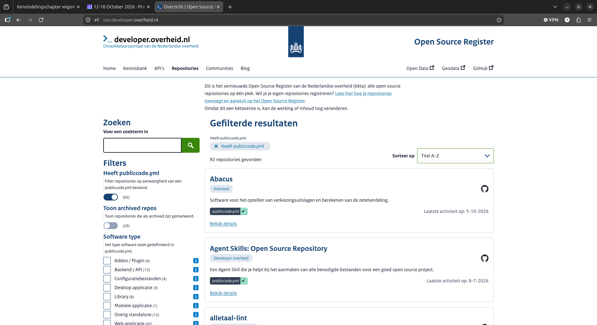
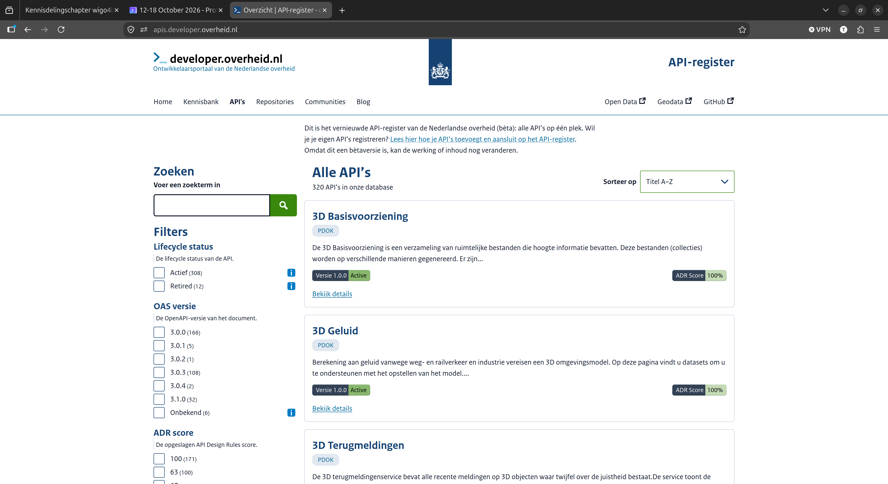
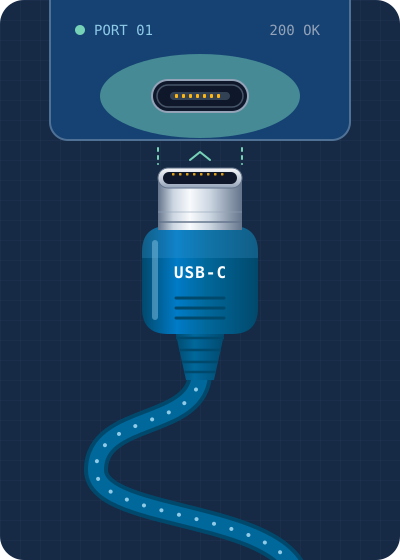
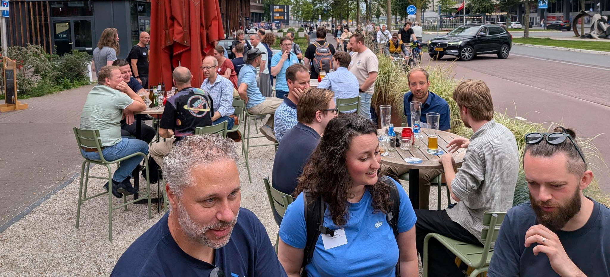

# Kennisdelingschapter wigo4it: developer.overheid.nl

<!-- <p style="text-align: center; max-width: 60%; margin: 0 auto;">En waarom we veel meer moeten investeren in developertooling voor standaarden</p> -->

<!-- _class: title invert -->

<ul class="horizontal-list" style="margin-top: 3rem;">
  <li>Tom Ootes</li>
  <li>🐘 <a href="https://social.codefor.nl/@tomootes">@tomootes</a></li>
  <li>Den Haag</li>
  <li>13 Oktober 2026</li>
</ul>

<!--

Dankjewel Maurice. Ik wil graag inhaken op wat je eerder noemde, de standaard meetmethoden. 
In het geval van mijn doelgroep, developers is dat namelijk een nog logischere stap dan in andere vakgebieden.
In ons geval heten die meetinstrumenten eerder "tools" of "linters" of "checkers".
Ik ga de rest van deze presentatie gebruiken om uit te leggen hoe developers werken en wat we daarvan kunnen 
leren als het gaat om de compliance van standaarden.

-->

## whoami?

<!-- _class: invert -->

<div class="two-columns">
  <ul>
    <li>Tom Ootes</li>
    <li>Developer.overheid.nl (2023)</li>
    <li>Open Source, Developer Advocate</li>
    <li>Community, outreach</li>
  </ul>
  <div>
    
  </div>
</div>

<!--
Kort eerst iets over mijzelf.

Ik ben Tom, werk al sinds 2023 aan developer.overheid.nl. Als freelancer 
veel verschillende overheidsprojecten gedaan. Vind het mooi om daar aan te 
werken omdat we met developer.overheid.nl een gemeenschappelijk platform 
hebben om developers op een-duidige manier software te laten bouwen.

Mijn rol is developer advocate wat betekent dat ik me verdiep in wat developers
nodig hebben om bijvoorbeeld compliant te kunnen worden aan een standaard.

-->


## developer.overheid.nl



<!-- _class: invert -->

<!--

Bottom up
Open Source

-->

## Kennisbank



<!-- _class: invert -->

<!--

Volledig open source op allerlei thema's
Opgedeeld in standaarden/ tools/ tutorials

-->

## Open Source Catalogus

<!-- _class: invert -->



<!-- 

Metadata op basis van publiccode.yml 

-->

## API Catalogus




<!-- _class: invert -->


<!-- _class: invert -->

<!-- 

Dinsdag 15 december mag in de agenda's!

-->

## API Design Rules

- `/core/doc-openapi-contact`: contactinformatie in de OAS
- `/core/doc-openapi`: beschrijf de API met OpenAPI
- `/core/http-methods`: alleen standaard HTTP-methods
- `/core/no-trailing-slash`: geen trailing slash in paden
- `/core/publish-openapi`: publiceer `/openapi.json`
- `/core/semver`: Semantic Versioning
- `/core/uri-version`: major versie in de URI (`/v1`)
- `/core/version-header`: `API-Version` response-header

<!-- _class: invert -->

## Standaardisering

<div class="two-columns">
  <ul>
    <li>Voorkomt discussies</li>
    <li>1 overheid</li>
    <li>Voorspelbaarheid</li>
    <li>Makkelijker ontsluiten</li>
    <li>Tooling bouwen</li>
  </ul>
  <div>
    
  </div>
</div>

## `don-checker`

## Developers vragen het aan AI

<!-- _class: invert -->

- Niemand leest eerst de kennisbank, je vraagt het je AI-assistent
- Maar die kent de Nederlandse standaarden slecht:
  - verouderde versies
  - verzonnen regels
  - Engelstalige "best practices" in plaats van NL GOV
- **Oplossing:** breng de kennisbank naar de assistent

<!--

Eerlijk is eerlijk: developers openen niet eerst developer.overheid.nl.
Ze stellen hun vraag in Claude Code, Cursor of Copilot.
Dan wil je dat het antwoord gebaseerd is op onze standaarden, en niet op
een willekeurige blogpost van vijf jaar geleden.

-->

## Agent skills

<!-- _class: invert -->

<div class="two-columns">
  <ul>
    <li>Pakketje kennis + instructies voor een AI-assistent</li>
    <li>Gewone markdown in een Git-repo</li>
    <li>Wordt automatisch geladen als het onderwerp langskomt</li>
    <li>Open source, dus te reviewen en verbeteren</li>
  </ul>
  <div>

```text
skills/ls-api/
└── SKILL.md
    ---
    name: ls-api
    description: API Design Rules,
      Spectral linter, problem+json…
    ---
    # API Design Rules (NL GOV)
    ...
```

  </div>
</div>

<!--

Een skill is niets magisch: een markdown-bestand met een korte beschrijving.
Als je vraag over API's gaat, laadt de assistent de skill en werkt hij met
de actuele regels, links naar de bron en de juiste linter-commando's.

-->

## Skills marketplace

<!-- _class: invert -->

<style scoped>table { font-size: 0.7em; } td, th { padding: 0.3em 0.6em; }</style>

| Plugin | Over | Beheer |
|---|---|---|
| `standaarden` | ADR, Digikoppeling, OAuth NL, FSC, Logboek Dataverwerkingen | DON |
| `developer-overheid` | De kennisbank: API's, data, security, front-end, infra | DON |
| `nerds` | NeRDS-richtlijnen voor digitale systemen | MinBZK |
| `geo` | OGC API, NEN 3610, INSPIRE, 3D | DON |
| `internet` | HTTPS, DNSSEC, DMARC, … (internet.nl) | DON |
| `zad-actions` | Deployment via ZAD | Rijks ICT Gilde |

<!--

Eén centrale catalogus: github.com/developer-overheid-nl/skills-marketplace
Werkt in Claude Code en Cursor.
Let op: status concept, het zijn samenvattingen, de officiële standaard blijft leidend.

-->

## Installeren

<!-- _class: invert -->

```bash
# Claude Code
claude plugin marketplace add developer-overheid-nl/skills-marketplace
claude plugin install standaarden@overheid-plugins
claude plugin install developer-overheid@overheid-plugins
```

**Cursor:** Settings → Plugins → Import
→ `developer-overheid-nl/skills-marketplace`

## Demo: van prompt naar linter

<!-- _class: invert -->

> "Maak een OAS-spec van waterkeringen, die net niet klopt, zodat ik hem kan linten met de ADR-checker"

1. Assistent laadt de skill `standaarden:ls-api`
2. Schrijft een OpenAPI-spec op basis van het Aquo-schema
3. Draait Spectral met de DON-ruleset
4. Repareert → **0 errors**

<!--

Dit is letterlijk hoe de demo-spec voor deze presentatie gemaakt is.
De assistent wist zelf welke ruleset-URL te gebruiken en welke regels er zijn,
omdat dat in de skill staat. Eventueel live laten zien.

-->

## Bouw je eigen skill

<!-- _class: invert -->

- Jullie domeinkennis als skill: voor je eigen team én voor andere gemeenten
- Eisen: open-source licentie, publieke repo, Nederlandse documentatie
- Aanmelden via een issue op de marketplace

`github.com/developer-overheid-nl/skills-marketplace`

<!--

Wigo4it heeft veel kennis van het sociaal domein en van de G4-systemen.
Als die kennis als skill beschikbaar is, profiteren nieuwe collega's én
andere gemeenten ervan.

-->


## Bijdragen


## Events!



<!-- Zet 15 december in je agenda -->

## Vraag aan jullie
- Doe mee!

## Bedankt! 

Vragen?

🐘 [@tomootes](https://social.codefor.nl/@tomootes)
📬 t.ootes@geonovum.nl