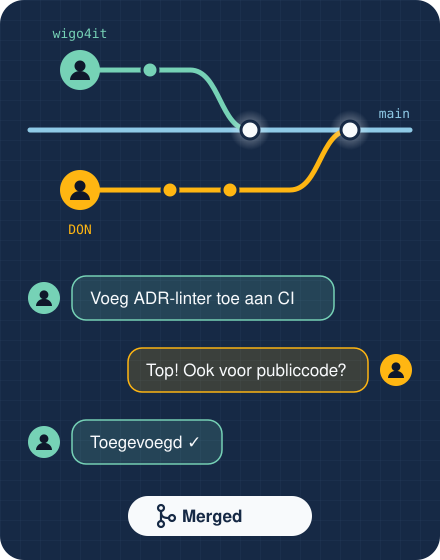
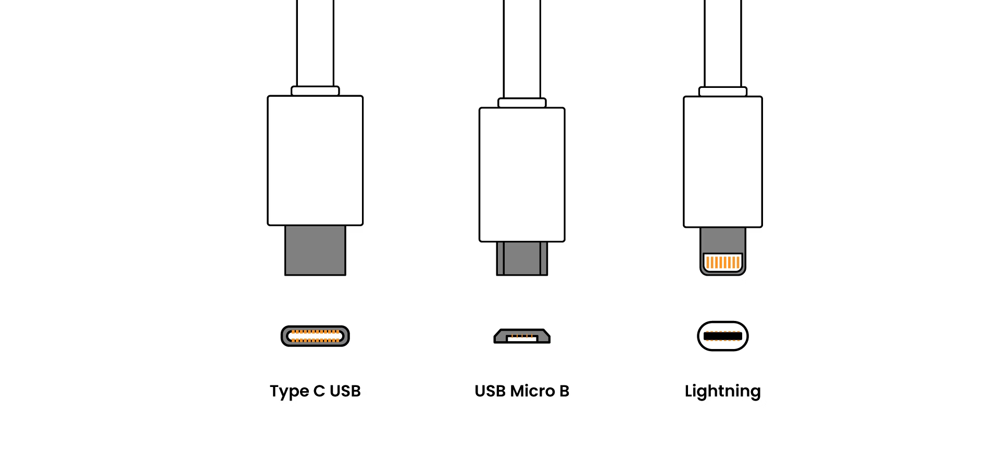
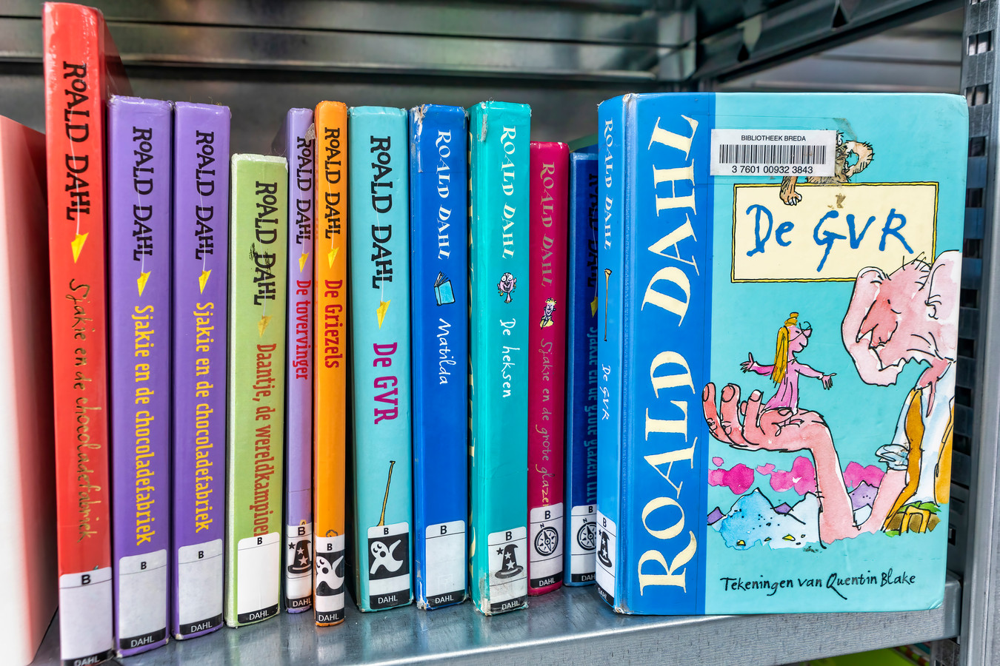
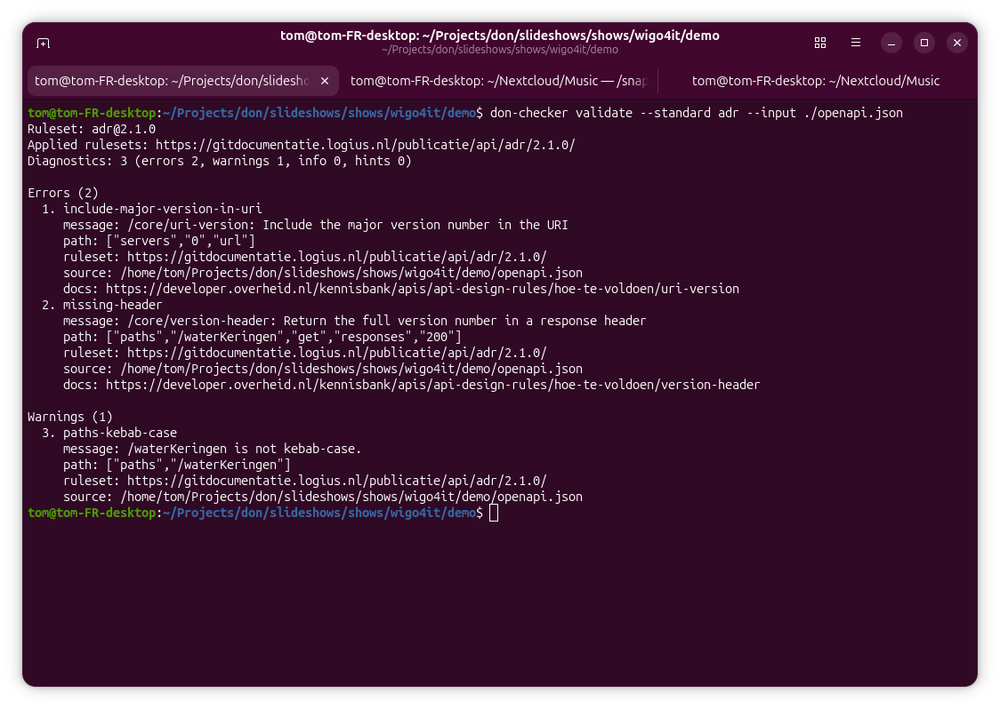
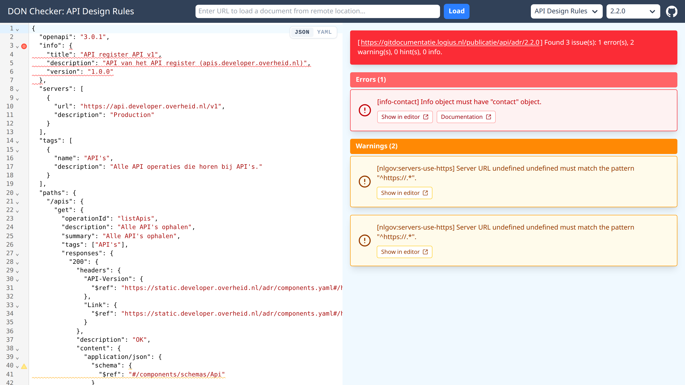
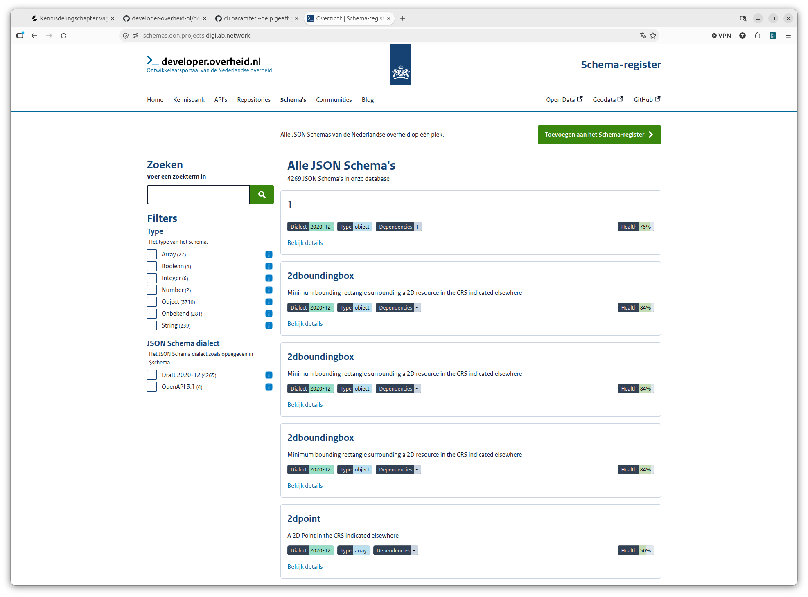

# Kennisdelingschapter wigo4it developer.overheid.nl

<!-- <p style="text-align: center; max-width: 60%; margin: 0 auto;">En waarom we veel meer moeten investeren in developertooling voor standaarden</p> -->

<!-- _class: title invert -->

<ul class="horizontal-list" style="margin-top: 3rem;">
  <li>Tom Ootes</li>
  <li>🐘 <a href="https://social.codefor.nl/@tomootes">@tomootes</a></li>
  <li>Den Haag</li>
  <li>13 Oktober 2026</li>
</ul>

<!--


-->

## whoami?

<!-- _class: invert -->

<div class="two-columns">
  <ul>
    <li>Tom Ootes</li>
    <li>Developer.overheid.nl (2023)</li>
    <li>Open Source, Developer Advocate</li>
    <li>Community, outreach</li>
  </ul>
  <div>
    
  </div>
</div>

<!--
Kort eerst iets over mijzelf.

Ik ben Tom, werk al sinds 2023 aan developer.overheid.nl. Als freelancer 
veel verschillende overheidsprojecten gedaan. Vind het mooi om daar aan te 
werken omdat we met developer.overheid.nl een gemeenschappelijk platform 
hebben om developers op een-duidige manier software te laten bouwen.

Mijn rol is developer advocate wat betekent dat ik me verdiep in wat developers
nodig hebben om bijvoorbeeld compliant te kunnen worden aan een standaard.

-->


## How did i get here?

- 😷 Bron- en contactonderzoek [COVID-19]
- 📝 Vragenlijsten en formulieren
- 📋 Informeren/ statistieken
- ⚕️ Ministerie van Volksgezondheid, Welzijn en Sport

## Agenda

<!-- _class: invert -->

1. Waarom standaardiseren?
2. developer.overheid.nl & de kennisbank
3. Open source en `publiccode.yml`
4. API's: catalogus, API Design Rules en de `don-checker`
5. AI skills voor overheidsstandaarden
6. In BETA: Schema-register
7. Vraag aan jullie & events

## Hoe werken we samen?

<div class="two-columns">
  <ul>
    <li>Hoe helpen we developers?</li>
    <li>Convergentie qua werkwijze</li>
    <li>Hogere kwaliteit</li>
  </ul>
  <div>
    
  </div>
</div>

<!--

-->


## Standaardisering

<div class="two-columns">
  <ul>
    <li>Voorkomt discussies</li>
    <li>1 overheid</li>
    <li>Voorspelbaarheid</li>
    <li>Makkelijker ontsluiten</li>
    <li>Makkelijker tooling bouwen</li>
  </ul>
  <div>
    
  </div>
</div>

<!-- 


-->


## developer.overheid.nl


<!-- _class: invert -->

<!--

Wegwijzer
Bottom up
Open Source
Dus als je een foutje ziet, file an issue
Wil je een feature? Draag ook een issue aan 

Vanuit de overheid worden hoge eisen aan software gesteld
Er zijn veel standaarden, echter niet voldoende tooling om iteratief te checken
Dit bouwen wij!
De sweet spot is dus: handige tools leveren aan developers, zodat ze makkelijker kunnen werken
maar waardoor ze ook direct compliant zijn aan de standaarden!

-->

## Kennisbank


<!-- _class: invert -->

<!--

Volledig open source op allerlei thema's
Opgedeeld in standaarden/ tools/ tutorials

-->

## Open Source Catalogus

<!-- _class: invert -->


<!-- 

Metadata op basis van publiccode.yml 

-->

## 🪄 publiccode.yml

<div class="two-columns">
  <ul>
    <li>Metadata-standaard voor open source van de overheid</li>
    <li>In 2018 ontstaan in Italië</li>
    <li>Eén YAML-bestand in de root van je repo</li>
    <li>Werkt op elk Git-platform</li>
    <li>Gebruikt door catalogi in 🇮🇹 🇫🇷 🇩🇪 🇳🇱</li>
  </ul>
  <div>
    
  </div>
</div>

<!--

Dit is de bron van de Open Source Catalogus die je net zag.
Het bestand werkt als een vlag: "dit is overheidssoftware, en je mag het hergebruiken".
Het is machineleesbaar, dus catalogi kunnen het automatisch oppikken.

-->

## Hoe ziet dat eruit?

<!-- _class: invert -->

```yml
publiccodeYmlVersion: "0.7"
name: don-checker
url: "https://github.com/developer-overheid-nl/don-checker"
softwareType: standalone/other
developmentStatus: stable
platforms: [web, linux]

organisation:
  uri: "https://developer.overheid.nl"
  name: developer.overheid.nl

supports:
  - id: https://gitdocumentatie.logius.nl/publicatie/api/adr/

description:
  nl:
    shortDescription: Controleer je API tegen de API Design Rules
    longDescription: >
      ...
    features:
      - Linter voor OpenAPI-specificaties
      - Te draaien in CI

legal:
  license: EUPL-1.2

maintenance:
  type: internal
  contacts:
    - name: Team developer.overheid.nl

localisation:
  localisationReady: false
  availableLanguages: [nl]
```

<!--

Naam, URL, status, licentie, onderhoud: dat is eigenlijk alles.
De longDescription is ingekort voor de slide.

Nieuw sinds 0.5: `organisation` (wie publiceert de software, met een URI).
Nieuw in 0.7: `supports`, welke standaarden/regelgeving de software ondersteunt
(hier de API Design Rules). Vervangt de landspecifieke secties.

-->

## Waarom zou je het doen?

<!-- _class: invert -->

- **Vindbaar**: je project komt in de Open Source Catalogus
- **Hergebruik**: andere organisaties ontdekken wat al bestaat
- **Context**: status, licentie en onderhoud in één oogopslag
- **Internationaal**: dezelfde standaard in heel Europa
- **Laagdrempelig**: één bestand, een paar minuten werk

<!--

Validatie kan met publiccode-parser-go, ook in je CI.
Uitleg in de kennisbank:
https://developer.overheid.nl/kennisbank/open-source/standaarden/publiccode-yml

-->

## `don-checker` voor je `publiccode.yml`

<!-- _class: invert -->

- Zelfde tool, andere standaard: `--standard publiccode`
- Versies `0.5` en `0.7` (default: `0.7`)
- Lokaal, in de web-app of in je CI (exit code ≠ 0 bij fouten)

```bash
npx @developer-overheid-nl/don-checker@latest validate \
  --standard publiccode \
  --input ./publiccode.yml
```


## API Catalogus


<!-- _class: invert -->

<!-- 

Dinsdag 15 december mag in de agenda's!

-->


## API Design Rules

<!-- _class: invert code-list -->

- `/core/doc-openapi-contact` contactinformatie in de OAS
- `/core/doc-openapi` beschrijf de API met OpenAPI
- `/core/http-methods` alleen standaard HTTP-methods
- `/core/no-trailing-slash` geen trailing slash in paden
- `/core/publish-openapi` publiceer `/openapi.json`
- `/core/semver` Semantic Versioning
- `/core/uri-version` major versie in de URI (`/v1`)
- `/core/version-header` `API-Version` response-header


## `don-checker` cli



## `don-checker` web-app



<!-- _class: invert -->

<!-- https://developer-overheid-nl.github.io/don-checker/ -->

## AI Skills

<!-- _class: invert -->

- Niet genoeg mensen lezen de kennisbank, je vraagt het je AI-assistent
- Maar die kent de Nederlandse standaarden slecht:
  - verouderde versies
  - verzonnen regels
  - Engelstalige "best practices" in plaats van NL GOV
- **Oplossing:** biedt de kennisbank aan in de assistent

<!--

Eerlijk is eerlijk: developers openen niet eerst developer.overheid.nl.
Ze stellen hun vraag in Claude Code, Cursor of Copilot.
Dan wil je dat het antwoord gebaseerd is op onze standaarden, en niet op
een willekeurige blogpost van vijf jaar geleden.

-->

## Agent skills

<!-- _class: invert -->

<div class="two-columns">
  <ul>
    <li>Pakketje kennis + instructies voor een AI-assistent</li>
    <li>Gewone markdown in een Git-repo</li>
    <li>Wordt automatisch geladen als het onderwerp langskomt</li>
    <li>Open source, dus te reviewen en verbeteren</li>
  </ul>
  <div>

```sh
skills/ls-api/
└── SKILL.md
    ---
    name: ls-api
    description: API Design Rules,
      Spectral linter, problem+json…
    ---
    # API Design Rules (NL GOV)
    ...
```

  </div>
</div>

<!--

Een skill is niets magisch: een markdown-bestand met een korte beschrijving.
Als je vraag over API's gaat, laadt de assistent de skill en werkt hij met
de actuele regels, links naar de bron en de juiste linter-commando's.

-->

## Skills marketplace

<!-- _class: invert -->

<style scoped>table { font-size: 0.7em; } td, th { padding: 0.3em 0.6em; }</style>

| Plugin | Over | Beheer |
|---|---|---|
| `standaarden` | ADR, Digikoppeling, OAuth NL, FSC, Logboek Dataverwerkingen | DON |
| `developer-overheid` | De kennisbank: API's, data, security, front-end, infra | DON |
| `nerds` | NeRDS-richtlijnen voor digitale systemen | MinBZK |
| `geo` | OGC API, NEN 3610, INSPIRE, 3D | DON |
| `internet` | HTTPS, DNSSEC, DMARC, … (internet.nl) | DON |
| `zad-actions` | Deployment via ZAD | Rijks ICT Gilde |

<!--

Eén centrale catalogus: github.com/developer-overheid-nl/skills-marketplace
Werkt in Claude Code en Cursor.
Let op: status concept, het zijn samenvattingen, de officiële standaard blijft leidend.

-->


## Schema-register



<!-- _class: invert -->

<!--

https://schemas.don.projects.digilab.network
Alle JSON Schemas van de overheid op één plek: ruim 4.200 schema's.
Zoeken en filteren op type en dialect, per schema een health-score.
Eigen schema's toevoegen kan via "Toevoegen aan het Schema-register".

-->


## Schemavoorbeeld: adres

[> Naar adresUitgebreid op catalogus](https://schemas.don.projects.digilab.network/schemas?q=AdresUitgebreid)

<!-- _class: invert -->

<style scoped>
  pre { font-size: 0.75em; }
  .hljs-attr { color: #8fcae7; }
  .hljs-string { color: #f9e11e; }
  .hljs-number, .hljs-literal { color: #ffb612; }
</style>

```json
{
  "title": "Adres",
  "type": "object",
  "properties": {
    "openbareRuimteNaam": { "type": "string", "maxLength": 80 },
    "huisnummer":         { "type": "integer", "minimum": 1, "maximum": 99999 },
    "huisletter":         { "type": "string", "pattern": "^[a-zA-Z]{1}$" },
    "postcode":           { "type": "string", "pattern": "^[1-9]{1}[0-9]{3}[A-Z]{2}$" },
    "woonplaatsNaam":     { "type": "string", "maxLength": 80 }
  },
  "required": ["openbareRuimteNaam", "huisnummer", "woonplaatsNaam"]
}
```

<!--

Ingekorte versie van AdresUitgebreid (BAG, Kadaster).
Volledige beknopte versie: shows/wigo4it/adres.schema.json

-->

## Vraag aan jullie!

- Zet jullie API's in ons API register
- Voeg een `publiccode.yml` toe aan jullie open source repo's
- Draai de don-checker in jullie CI
- Gastblogs/ artikelen
- Issues/ Pr's
- Sluit aan bij de werkgroep JSON Schema of ADR
- Op termijn: schema's aanleveren?

## Events!

<style scoped>
  .event-qr { position: absolute; right: 95px; top: 170px; z-index: 3; display: flex; flex-direction: column; align-items: center; }
  .event-qr img { background: #fff; padding: 8px; border-radius: 8px; }
  .event-qr span { margin-top: 0.3em; font-size: 0.6em; background: #fff; padding: 0 0.4em; border-radius: 4px; }
</style>


<div class="event-qr">
  
  <span>Meld je aan!</span>
</div>

<!-- Zet 15 december in je agenda -->

## Bedankt! 

Vragen?

🐘 [@tomootes](https://social.codefor.nl/@tomootes)
📬 t.ootes@geonovum.nl