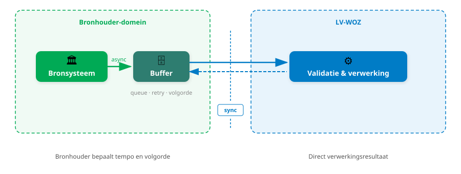
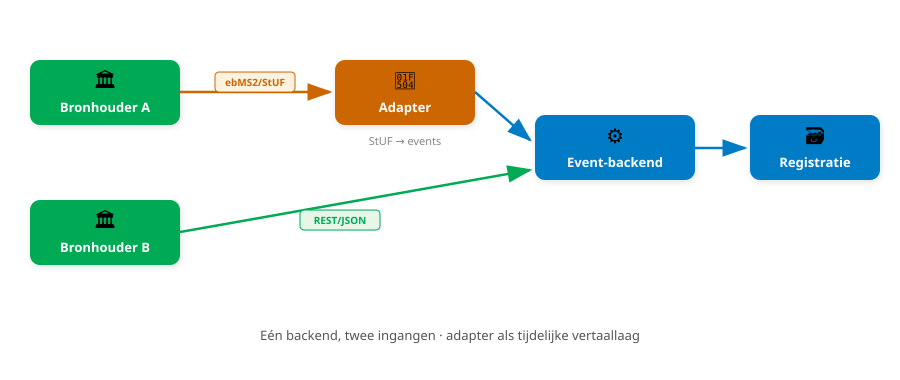

<!-- _class: title -->

# Oplossingsrichtingen LV-WOZ

Discussiesessie

**Kennisborging en implementatieondersteuning** · Geonovum · 11 maart 2026

---

## Synchroon koppelvlak, asynchrone bron

- Bronhouder stuurt gebeurtenis, ontvangt **direct** het verwerkingsresultaat
- Asynchroniteit bij de bron: bronsysteem buffert intern en bepaalt zelf verzendtempo en volgorde
- Adresseert vertraagde foutmeldingen, foutcorrelatie en volgordeproblemen
- Capaciteitsbeheersing via `RateLimit`-headers

Betrouwbaarheidsfuncties verschuiven van MSH-middleware naar de applicatielaag. Elke leverancier moet buffering en retry individueel implementeren.

**Discussie:** Is de implementatielast per saldo lager? Hoe voorkomen we dat kleinere bronhouders opnieuw afhankelijk worden van intermediairs? Ruimer quotum tijdens beschikkingsperiode?

---

## Synchroon koppelvlak, asynchrone bron

---

## Gebeurtenis-gedreven aanlevering

- Bronhouders leveren **domeingebeurtenissen** ("waarde vastgesteld", "bezwaar afgehandeld")
- Niet: toestandsmutaties (oud/nieuw-paren zoals in StUF)
- Correcties zijn compenserende gebeurtenissen, geen overschrijvingen
- Interpretatielast verschuift van bronhouder naar LV; geen her-interpretatielast voor afnemers

**Discussie:** Kunnen leveranciers domeingebeurtenissen genereren vanuit hun procesgang? Is de set van 21 dienstberichten een werkbaar vertrekpunt? Hoe voorkomen we divergentie tussen de lokale registratie en de LV?

---

## LV-eigen formele historie

- LV bouwt eigen formele tijdlijn op uit verwerkte gebeurtenissen
- Bronhouder-formele historie wordt voor de WOZ **niet** overgenomen
- Afnemers bevragen: "wat wist de LV op moment X?"

De BAG neemt bronhouder-formele historie wel over; voor de WOZ valt de afweging anders uit.

**Discussie:** Zijn er WOZ-afnemers die bronhouder-formele historie nodig hebben? Eventueel overnemen als regulier gegeven, zonder validatie en tijdreismogelijkheden?

---

## Validatie en foutstrategie

- **Validatie-vooraf API** (optioneel): iteratief valideren voor definitieve indiening
- Twee categorieën fouten bij definitieve indiening:

| Categorie                               | Voorbeeld                                                              | Gedrag                      |
| --------------------------------------- | ---------------------------------------------------------------------- | --------------------------- |
| **Integriteits- en consistentiefouten** | Ontbrekende gegevens, ongeldige referenties, temporele inconsistenties | Afkeuren                    |
| **Functionele kwaliteitsfouten**        | WOZ-waarde buiten statistische bandbreedte                             | Accepteren met waarschuwing |

**Discussie:** Is het onderscheid tussen de drie categorieën helder genoeg? Wie bepaalt de grens?

---

## Informatiemodel

- **Subjectgegevens**: verwijzing naar de bron (BSN/BRP voor ingezetenen, RSIN/KvK-nummer voor bedrijven) i.p.v. gegevens mee-registreren; uitsluitend actuele identificatiemiddelen (BSN, RSIN, vestigingsnummer)
- **Levenscyclus**: onderscheid tussen
  - beëindigd (eindstatus, object blijft in registratie)
  - verwijderd (uit registratie, `eindRegistratie` is ingevuld)

**Discussie:** Kwaliteit Handelsregister en buitenlandse eigenaren: hoe ga je om met subjectgegevens die bij de bron niet kloppen? Is de BRP-koppeling bij de LV voldoende beschikbaar? Juridische implicaties?

---

## Afnemerszijde: CQRS en notificaties

- **Bijhouding**: functionele API (domeingebeurtenissen)
- **Bevraging**: resourcegerichte API (REST/JSON + tijdreisparameters)
- **Wijzigingsfeed** (pull) als primair distributiekanaal: afnemers halen op in eigen tempo
- **Push-notificaties** (webhooks) als aanvulling voor real-time signalering
- Beide op basis van CloudEvents (NL GOV profile)

CQRS impliceert eventual consistency: korte vertraging tussen aanlevering en beschikbaarheid.

**Discussie:** Wat is een aanvaardbare verwerkingsvertraging? Volstaat de wijzigingsfeed, of zijn real-time notificaties nodig?

---

## Transitie: adapter-patroon en fasering

- LV bouwt vanaf het begin een **event-backend**
- Bestaand ebMS2/StUF-koppelvlak functioneert als adapter (vertaallaag)
- Fasering gekoppeld aan **softwareleveranciers** (beperkt aantal, groot bereik)
- Parallelle aanlevering maakt vergelijking mogelijk

De vertaling van StUF-correcties naar compenserende gebeurtenissen is foutgevoelig. Een prototype-adapter kan de haalbaarheid vroeg valideren.

**Discussie:** Is de vertaling haalbaar voor alle 21 berichttypen en de synchronisatieberichten?

---

## Transitie: adapter-patroon

---

<!-- _class: title -->

# Vragen of aanvullingen?
