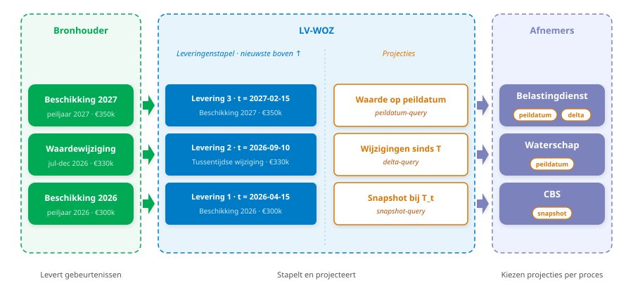
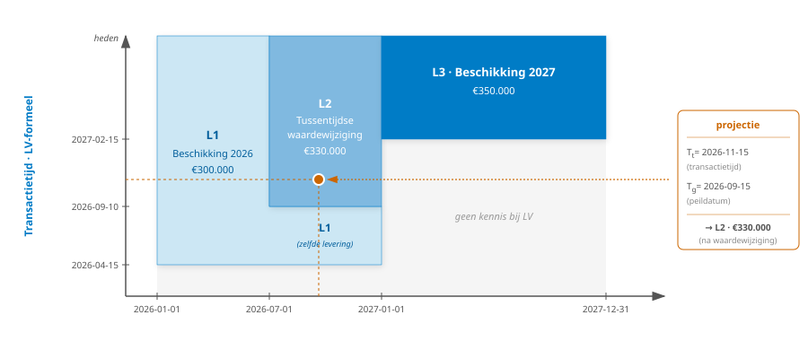
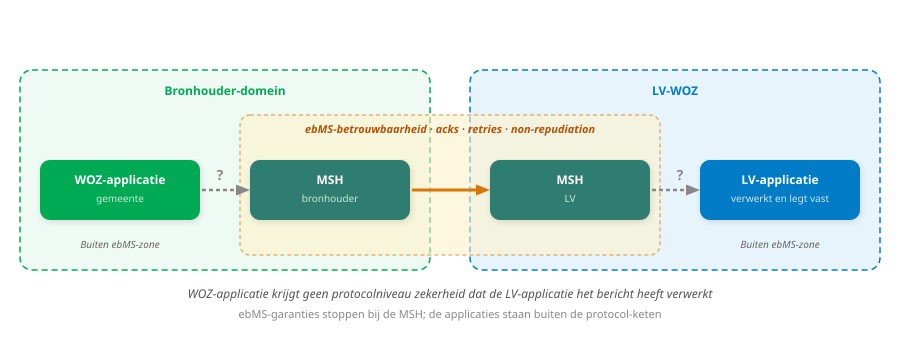

<!-- _class: title -->

# Oplossingsrichtingen LV-WOZ

**Kennisborging en implementatieondersteuning** · Geonovum · 13 mei 2026

---

## Agenda

1. Gezamenlijk beeld vooraf
   - Scope en tijdlijn van de herbouw
   - IMWOZ en de landelijke voorziening
2. Tijdlijnen bij bronhouder en LV-WOZ
3. Synchrone vs. asynchrone verwerking
4. _(Als er tijd over is)_ Wijzigingen aan IMWOZ binnen scope LV-WOZ
5. Vervolgafspraken

<!--
Vijf agendapunten voor deze sessie.

Item 1 (Gezamenlijk beeld): voordat we inhoudelijk diep duiken, zorgen we dat we dezelfde verwachtingen hebben over scope, tijdlijn en informatiemodel. Twee sub-onderwerpen.

Item 2 (Tijdlijnen): eerste inhoudelijke zwaartepunt. Komt overeen met hoofdstuk 9.1 in het adviesrapport. Wettelijke ruimte, afnemerseisen, oplossingsrichtingen.

Item 3 (Synchroon vs asynchroon): tweede inhoudelijke zwaartepunt. Komt overeen met hoofdstuk 9.2. Focus op piekbelasting en koppelvlak-keuzes.

Item 4 (IMWOZ wijzigingen): alleen als er tijd over is. Kan ook in een vervolgsessie.

Item 5 (Vervolgafspraken): aan het eind, open punten en afspraken beleggen.
-->

---

## Scope en tijdlijn van de herbouw

- Kadaster werkt aan **vernieuwing LV-WOZ**
- Adviesrapport Geonovum behandelt het **koppelvlak gemeenten ↔︎ LV-WOZ**

Doel: gemeenschappelijke verwachtingen over scope, tijdlijn en besluitvorming voordat we de inhoud bespreken.

**Discussie:**

- Wat is de verwachte tijdslijn?
- Met welke afhankelijkheden dient rekening gehouden te worden?

<!--
Kadaster heeft het programma vernieuwing LV-WOZ opgestart. Doel: vervanging van het ebMS2/StUF-koppelvlak en de onderliggende voorziening.

Het adviesrapport van Geonovum focust op het koppelvlak gemeenten → LV-WOZ (aanlevering). Verstrekking aan afnemers raakt dit indirect via projecties.

Punten om scherp te krijgen:
- Tijdlijn implementatie - wanneer kunnen we spreken over piloten?
- Verhouding tot vervangingsmoment ebMS2
- Wie heeft welke rol? Waarderingskamer schrijft eisen; Kadaster implementeert; Geonovum adviseert; VNG vertegenwoordigt gemeenten en leveranciers.

Afhankelijkheden:
- Programma Digikoppeling (REST-profiel maturity)
- FSC (toegangsbeheer)
- Werkgroep Historie en Tijdreizen (Kennisplatform APIs)
- Andere basisregistratie-vernieuwingen
-->

---

## IMWOZ en de landelijke voorziening

- Huidig **IMWOZ 3.12** dekt totale WOZ-domein; ca. 20× omvang van LV-deel
- Waarderingskamer ontwikkelt een **LV-profiel op IMWOZ**, in afstemming met Kadaster

**Discussie:**

- Wat is de planning voor IMWOZ?
- Wat is er nodig om IMWOZ vastgesteld te krijgen?

<!--
Het huidige IMWOZ 3.12 is gericht op het hele WOZ-domein. Veel elementen zijn relevant voor gemeentelijke processen maar niet (direct) voor wat naar de LV gaat. Het LV-deel beslaat een fractie van het totaalmodel (door de Waarderingskamer ingeschat op ca. 1/20 van de omvang).

De Waarderingskamer heeft in afstemming met Kadaster afgesproken een LV-profiel op te stellen naast IMWOZ 3.12. Voordelen van een profiel:
- Duidelijkere scope voor het koppelvlak
- Validatieregels specifieker
- Profiel kan evolueren los van het bredere IMWOZ

Voorwaarden voor een profiel:
- Stabiele basis (anders is profiel ook instabiel)
- Helder onderhoudsproces voor IMWOZ
- Governance: wie mag wat wijzigen, wie keurt goed
- Versie- en compatibiliteitsbeleid

Verhouding tot Catalogus Basisregistratie WOZ: catalogus geeft semantiek; model formaliseert structuur. Beide moeten consistent blijven.
-->

---

<!-- _class: title -->

# Leveren en overeenstemmen

---

## Aanleiding: conforme kopie versus praktijk

Huidige uitgangspunt: **conforme kopie** van gemeentelijke administratie.

Dit is leidend geweest bij het ontwerp van het huidige koppelvlak.

- Praktijk 1: LV legt **geen 1-op-1 spiegel** vast, maar reconstrueert historie uit XML-mutaties
- Praktijk 2: validatie en afkeuring **creëren** per definitie verschillen tussen bron en LV

Conforme kopie en strikte validatie zijn moeilijk verenigbaar.

<!--
"Conforme kopie" is door de Waarderingskamer leidend geweest bij het ontwerp van het huidige koppelvlak: de gegevens in de LV moeten een volledige kopie zijn van de gemeentelijke administratie.

Praktijk 1 - reconstructie:
- LV reconstrueert formele historie uit binnenkomende XML-mutaties en berekent afgeleide tijdlijnwaarden (begin- en eindgeldigheden).
- Niet alle bronhouders zijn in staat historische registraties in juiste sequentie aan te leveren; LV kan dan geen sluitende reconstructie opbouwen.

Praktijk 2 - validatie:
- Elk afgekeurd bericht creëert per definitie een verschil tussen wat de gemeente registreert en wat de LV vastlegt.

Onderliggend spanningsveld: validatie creëert verschillen waar zij afkeurt; reconstructie creëert een vastlegging die structureel verschilt van de bronregistratie. Een herformulering van het uitgangspunt biedt ruimte om dit aan te pakken zonder afnemerseisen te wijzigen.
-->

---

## Wettelijke basis: leveren en overeenstemmen

Artikel 37b Wet WOZ:

> - _Het college van B&W levert waardegegevens met temporele en meta-kenmerken aan de Landelijke Voorziening._
> - _De gegevens die de LV aan afnemers verstrekt moeten overeenkomen met wat het college heeft geleverd._

De wet spreekt niet van 1-op-1 kopie. "Conforme kopie" is een ontwerpinvulling.

**Discussie:**

- Volstaat deze juridische lezing?
- Biedt dit ruimte voor een andere ontwerpinvulling die dezelfde wettelijke eis vervult?

<!--
Artikel 37b Wet WOZ verplicht:
- Lid 1-4: het college van B&W levert waardegegevens met temporele en meta-kenmerken aan de Landelijke Voorziening.
- Lid 5-6: de gegevens die de LV aan afnemers verstrekt moeten overeenkomen met wat het college heeft geleverd.

De wet gebruikt de term "conforme kopie" niet. Die is door de Waarderingskamer geïntroduceerd als sturingsbegrip en is leidend geweest bij het huidige koppelvlakontwerp.

Punt voor discussie: deze lezing scheidt de wettelijke eis (overeenstemmen) van de ontwerpinvulling (1-op-1 kopie). Daarmee komt ruimte voor een andere ontwerpinvulling die dezelfde wettelijke eis vervult.

Naast de Wet WOZ regelt het Uitvoeringsbesluit kostenverrekening en gegevensuitwisseling Wet WOZ de formaatdefinities (mutatiecodes, bytelengtes, subjectnummer-categorieën). Dit besluit is sinds invoering vrijwel ongewijzigd; sommige categorieën worden niet meer gebruikt. Het advies kan oproepen tot actualisering van dit besluit als onderdeel van de modernisering.

Mogelijk andere kaders om te toetsen: AVG/privacy bij bewaartermijnen op de leveringenstapel, archiefwet, andere registratieve verplichtingen.
-->

---

## Voorgesteld model: drie samenhangende keuzes

| Keuze              | Wat                                             |
| ------------------ | ----------------------------------------------- |
| **Leveren**        | Gebeurtenis + kennisgevingen per object/periode |
| **Vastleggen**     | Leveringenstapel met eigen registratietijdlijn  |
| **Overeenstemmen** | Projecties op de stapel naar afnemers           |

In plaats van <strong>kopie</strong>-denken: gemeente levert feiten, LV legt vast, afnemer krijgt projectie.

<!--
Drie ontwerpkeuzes die samen één coherent voorstel vormen.

De samenhang:
- Het historiemodel (stapel-gebaseerd) volgt direct uit hoe we vastleggen.
- Het stapelpatroon werkt alleen als de gemeente gebeurtenis-gestuurd aanlevert (een mutatiepatroon zou een ander model vragen).
- Projecties zijn pas zinvol als er een onderliggende stapel is om uit te projecteren.

We behandelen de drie keuzes nu één voor één.
-->

---

## Leveren als gebeurtenis

- Levering = **gebeurtenis** + kennisgevingen van feiten (per object met eigen periode)
- **Kennisgeving** draagt nieuwe toestand, geen oud-nieuw paar zoals in StUF
- **Correcties** krijgen eigen gebeurtenistype
- Sluit aan bij denken van gemeente-medewerkers

Gemeente levert wat <strong>waar is</strong>, niet hoe registratie veranderde 

<!--
Het huidige koppelvlak is al gestructureerd rond gebeurtenissen. Een dienstbericht bundelt kennisgevingen rond één WOZ-gebeurtenis: nieuwe beschikking, uitspraak op bezwaar, opvoeren of beëindigen van een WOZ-object.

De huidige NBSK-dienstberichten vormen een werkbaar vertrekpunt; entiteiten en attributen bestaan al ongeveer 30 jaar. Naar de LV gaan maximaal circa 30 verschillende XML-berichten, gebaseerd op circa 20 verschillende gebeurtenissen. Geen reden om met die structuur te breken.

Het voorstel maakt de gebeurtenis het feitelijke voertuig van de aanlevering, in plaats van een bijschrift bij een toestandswijziging:

- Een levering bestaat uit een gebeurtenis-aanduiding plus één of meer kennisgevingen: gegevens per WOZ-object met eigen geldigheidsperiode. Eén gebeurtenis kan dus meerdere objecten en periodes meedragen (bijvoorbeeld een herwaarderingsronde waarin een serie objecten in één keer wordt beschikt). De term kennisgeving sluit aan op het huidige StUF-WOZ-jargon, maar draagt in dit voorstel alleen de nieuwe staat (geen oud-nieuw paar). Gemeente levert wat zij wil zeggen ("dit zijn de waarheden die deze gebeurtenis aangeeft"), niet hoe haar registratie van toestand A naar toestand B is overgegaan.
- Correcties krijgen een eigen gebeurtenistype. Het onderscheid tussen wijziging en correctie wordt expliciet, in plaats van afgeleid uit patronen in datamutaties.
- Voor gemeenten sluit dit aan bij hoe medewerkers al denken: men registreert een beschikking of een uitspraak op bezwaar, niet een attribuut-mutatie.

Discussiepunt: leveranciers moeten in hun procesgang de gebeurtenis kunnen vaststellen voordat zij het bericht opbouwen. Dat is een stap die nu deels impliciet is.
-->

---

## Vastleggen als stapel leveringen

- Elke levering: **tijdstip** van verwerking door LV
- Vormt **LV-formele tijdlijn**, los van bronhouder
- Bij overlap: **meest recente uitspraak telt**
- LV reconstrueert **geen** bronhouder-formele historie

"Wanneer wist de LV iets?" wordt voortaan door de LV zelf bijgehouden.

<!--
Gemeente levert wat materieel geldt voor een periode. LV legt vast wanneer welke levering is verwerkt en beschikbaar gemaakt. De stapel groeit aan; eerdere uitspraken worden niet overschreven.

- Elke levering krijgt een tijdstip waarop zij door de LV is verwerkt en beschikbaar voor bevraging. Deze reeks vormt een eigen registratietijdlijn (formele tijdlijn) van de LV.
- De materiële tijdlijn (geldigheidstijdlijn) blijft bij de bronhouder en wordt aangeleverd.
- Bij overlap in materiële geldigheid telt de meest recente uitspraak. LV manipuleert geen eindgeldigheden of tijdlijnposities.
- Gemeente kan binnen geldende termijnen met een nieuwe levering bijsturen. Hoeft historische registraties niet in specifieke sequentie aan te leveren.

De Belastingdienst heeft expliciet behoefte aan LV-formele historie en reconstrueert die op dit moment zelf, omdat de LV deze niet bijhoudt. In dit model wordt dat overbodig.

Discussiepunt: er kunnen afnemers zijn die de bronhouder-formele historie nodig hebben. Dan zou die als regulier gegeven (zonder validatie) kunnen worden meegeleverd.
-->

---

## Overeenstemmen via projecties

- **Projectie** = berekend antwoord uit de leveringenstapel
- **Beschouwingsmoment** maakt herhaalbaarheid mogelijk
  - LV geeft het terug in de respons; afnemer hergebruikt in latere request
  - Audit en bezwaarprocedures: aanslag later reproduceerbaar
  - Replica's en caches: eventual consistency afgevangen

Overeenstemming verankerd op niveau projecties, niet vastlegging.

<!--
Verstrekkingen aan afnemers worden afgeleid uit de leveringenstapel via projecties.

- Een projectie beantwoordt een specifieke vraag (wat was de waarde op peildatum P? wat wist de LV op tijdstip T?) op basis van dezelfde basisfeiten.
- Verschillende afnemers krijgen verschillende projecties, afgestemd op informatiebehoefte (Belastingdienst, waterschap, CBS), zonder dat zij onderliggende leveringen zelf moeten interpreteren.
- Een beschouwingsmoment maakt herhaalbare bevraging mogelijk: dezelfde vraag met hetzelfde beschouwingsmoment levert hetzelfde antwoord op.

Wat is het? Een markering die zegt: "geef me het antwoord zoals de LV het op moment X kende, niet de meest actuele stand". Vergelijkbaar met de uittreksel-datum bij BAG: het uittreksel blijft zeggen wat het zei, ook als de bron later wijzigt.

Waarom is het nodig? Concreet voorbeeld:
- 1 maart 2027: Belastingdienst legt aanslag op voor peildatum 2026-09-15, basis €330.000.
- 15 mei 2027: gemeente corrigeert de waarde naar €280.000 voor diezelfde peildatum.
- 1 juli 2027: burger maakt bezwaar tegen de aanslag.

Zonder beschouwingsmoment kan de bezwaarbehandelaar niet meer reconstrueren waarom de aanslag op €330.000 was gebaseerd. Met beschouwingsmoment (opgeslagen bij de aanslag, bijvoorbeeld 2027-03-01) levert opnieuw bevragen nog steeds €330.000 op: verdedigbaar en auditeerbaar.

Andere toepassingen:
- Cross-channel consistency: Belastingdienst, waterschap en CBS die dezelfde vraag stellen met hetzelfde beschouwingsmoment krijgen hetzelfde antwoord.
- Notify-pull patroon: de notificatie bevat het beschouwingsmoment; afnemer pulls precies die staat, niet een ondertussen gewijzigde versie.
- Technisch werkt het als consistency-token bij LV-replica's, projectie-caches of downstream-systemen: zelfde (peildatum, beschouwingsmoment)-combinatie levert overal hetzelfde antwoord, ondanks eventuele replicatie-lag. Vergelijk snapshot-reads in distributed databases (Spanner, MVCC).

Bestaande afnemerspatronen waarin een notificatie wordt aangevuld met bevraging blijven mogelijk; de bevraging levert in dat geval een projectie op.

Inhoudelijke overeenstemming blijft de norm: dezelfde vraag aan bron en LV moet hetzelfde antwoord opleveren. De structuur van vastlegging hoeft daarvoor niet identiek te zijn aan die van de bronhouder. Projecties borgen die overeenstemming.

Discussiepunt: vandaag bevat de verstrekkingscatalogus eigenlijk al impliciete projecties (verschillende dienstberichten voor verschillende afnemers). Maken we deze expliciet in een projectie-register?
-->

---

## Leveringenstapel en projecties

<!--
Drie hoofdkolommen, met Projecties als onderdeel van de LV-WOZ.

Bronhouder: drie leveringen voor één WOZ-object, elk met eigen gebeurtenis en geldigheidsperiode:
- Beschikking 2026 (peiljaar 2026, €300k)
- Tussentijdse waardewijziging (jul-dec 2026, €330k) - bv. na verbouwing
- Beschikking 2027 (peiljaar 2027, €350k)

LV-WOZ bevat twee aspecten:
- Leveringenstapel: de drie binnenkomende leveringen gestapeld in volgorde van binnenkomst, nieuwste boven. Elke krijgt een transactietijd (t) bij verwerking - dat vormt de eigen registratietijdlijn van de LV.
- Projecties: drie generieke projectie-typen die de LV op de stapel berekent:
  - Waarde op peildatum (peildatum-query) - "wat geldt op datum P?"
  - Wijzigingen sinds T (delta-query) - "wat is sinds T veranderd?"
  - Snapshot bij T_t (snapshot-query) - "wat wist de LV op T_t?"

Projecties zitten visueel binnen LV-WOZ omdat ze door de LV worden berekend op dezelfde stapel; geen aparte pijlen nodig.

Afnemers: organisaties die projecties consumeren. De tags in elk afnemer-vak laten zien welke projecties zij gebruiken:
- Belastingdienst: peildatum (voor aanslag) én delta (voor audit) - twee projecties voor twee processen
- Waterschap: peildatum (voor heffing)
- CBS: snapshot (voor statistische rapportage)

Sleutelpunt: projecties horen bij de LV (zij berekent ze), maar afnemers kiezen er per proces uit wat zij nodig hebben. Many-to-many: meerdere afnemers kunnen dezelfde projectie consumeren, één afnemer kan meerdere projecties consumeren. De getoonde tags zijn voorbeelden, niet uitputtend.

De volgende slide (Snodgrass) zoomt in op de leveringenstapel en laat zien hoe de drie leveringen vlakken vormen in (geldigheid × transactietijd), waarbij een projectie altijd één vlak aanwijst.
-->

---

## Stapelmodel als bitemporele tabel

Snodgrass-perspectief: elke kennisgeving een vlak in (geldigheid × transactietijd).

<!--
Snodgrass (1995) onderscheidt twee onafhankelijke tijdsdimensies in temporele databases:
- Geldigheidstijd (valid time): wanneer een feit waar is in de werkelijkheid - de materiële tijd.
- Transactietijd (transaction time): wanneer een feit is vastgelegd in het systeem - voor ons de LV-formele tijd.

Het stapelmodel uit het voorstel mapt direct op dit raamwerk:
- Elke kennisgeving bevat een geldigheidsperiode (begin- en eventueel eind-geldigheid) plus een transactietijd waarop zij door de LV is verwerkt.
- Een nieuwere levering kan een deel van een eerdere overrulen voor de overlappende geldigheidsperiode.
- Per (geldigheidstijd, transactietijd)-punt geldt steeds de meest recente levering die het punt overdekt.

In de illustratie: één WOZ-object, drie leveringen met verschillende geldigheidsperiodes:
- L1: Beschikking peiljaar 2026 · VT=[2026-01-01, 2026-12-31] · TT=2026-04-15 · €300k.
- L2: Tussentijdse waardewijziging (bijv. na verbouwing) · VT=[2026-07-01, 2026-12-31] · TT=2026-09-10 · €330k.
- L3: Beschikking peiljaar 2027 · VT=[2027-01-01, 2027-12-31] · TT=2027-02-15 · €350k.

Sleutelobservatie: L2 dekt alleen de tweede helft van peiljaar 2026. Voor de eerste helft (jan-jun) blijft L1 de actuele uitspraak, ook nadat L2 binnenkomt. Het vlak van L1 wordt daarmee L-vormig: volledig 2026 zolang L2 nog niet bekend is, daarna alleen nog VT in [jan, jun].

Een projectie wordt gespecificeerd door twee parameters:
- T_t (transactietijd / beschouwingsmoment): "wat wist de LV op tijdstip T_t?"
- T_g (geldigheidstijd / peildatum): "...voor welke materiële datum?"

In het voorbeeld: T_t = 8 mei 2027, T_g = 15 september 2026 → valt in L2 → €330k.

Andere projecties op dezelfde stapel:
- T_g = 15 maart 2026, T_t = nu → L1 (€300k); L2 dekt deze datum niet.
- T_g = 15 september 2026, T_t = 1 augustus 2026 → L1 (€300k); L2 was nog niet bekend.
- T_g = 30 juni 2027, T_t = nu → L3 (€350k).

Wat de illustratie zichtbaar maakt:
1. Horizontaal: verschillende geldigheidsperiodes (jan-jun 2026, jul-dec 2026, 2027) hebben elk hun eigen lopende waarde.
2. Verticaal: een vlak kan worden opgevolgd door een nieuwere uitspraak voor (een deel van) dezelfde periode.
3. Een projectie wijst altijd op exact één vlak voor elke combinatie (T_t, T_g).

Waarom deze Snodgrass-framing nuttig is:
1. De stapel is geen ad-hoc constructie maar een bekende databasestructuur. Standaardimplementaties bestaan (SQL:2011 heeft systeem-versionering).
2. Projecties zijn formele query-operaties (snapshot, sequenced, non-sequenced) die zich standaardiseren laten.
3. Herhaalbaarheid bij hetzelfde beschouwingsmoment volgt direct uit TT-fixatie: dezelfde (T_t, T_g) wijst altijd op hetzelfde vlak.

Verschil met klassieke bitemporele tabellen: bij Snodgrass kunnen rijen retroactief worden ingetrokken (TT-end wordt herschreven). In ons model wordt nooit ingetrokken: een nieuwe levering komt erbij. De vlakken blijven daarmee altijd reconstrueerbaar voor wie terugkijkt - een vereiste voor LV-formele historie.
-->

---

## Welke knelpunten dit (deels) oplost

| Knelpunt                         | Hoe                                               |
| -------------------------------- | ------------------------------------------------- |
| **Toestandsoverdracht**          | Nieuwe waarheid; geen oud-nieuw paar              |
| **Synchronisatieberichten**      | Nieuwe levering = normale bijstelling             |
| **Interpretatielast**            | Gebeurtenis expliciet; LV doet afleiding eenmalig |
| **Formele historie**             | LV bouwt eigen tijdlijn op                        |
| **Validatie versus divergentie** | Afkeuring beperkt; rest via terugmelden           |

Terugmeldfaciliteit wordt belangrijker; versterking is randvoorwaarde.

<!--
Niet elk knelpunt verdwijnt; sommige verschuiven of worden beperkter.

- Toestandsoverdracht: levering bevat de nieuwe waarheid voor een periode, niet oud-nieuw paar. Validatie tegen meegestuurde "oude situatie" vervalt, en daarmee een belangrijke bron van foutmeldingen die ontstaat als LV-toestand afwijkt van wat de bronhouder veronderstelt.

- Synchronisatieberichten: in de huidige inrichting noodgreep voor divergentie + terugvaloptie. In dit model: nieuwe levering is het normale mechanisme om een eerdere uitspraak bij te stellen.

- Interpretatielast: drie mechanismen verminderen de afleidingstaak. Gebeurtenis expliciet meegegeven; correcties met eigen type; LV doet de afleiding eenmalig en levert als projectie.

- Formele historie: LV bouwt eigen formele historie op. Eis dat bronhouders historische registraties in specifieke sequentie aanleveren vervalt.

- Validatie versus divergentie: afkeuring beperken tot wat verstrekking onmogelijk maakt. Functionele afwijkingen via terugmelden. Afnemerseis tot kwaliteitsborging verschuift naar terugmeldmechanisme.

Niet geraakt: transportlaag (komt in 9.2), identificatie van subjecten en relaties, kopiegegevens. StUF-WOZ-specifieke complexiteit indirect kleiner doordat eenduidige leveringen mutatiesemantiek vereenvoudigen. Terugmelden wordt belangrijker maar gebreken in de huidige faciliteit worden hierdoor niet opgelost.

Verwachte vraag: "Is dit niet hetzelfde model, alleen zonder de 'was'-situatie?" Antwoord: nee. Het weglaten van "was" is het meest zichtbare gevolg, maar rust op vijf samenhangende verschuivingen (zie volgende slide "Samenvattend"). Concreet: bij data-migratie raakt vandaag de "was" zoek en loopt de keten vast; in het voorstel niet, omdat LV geen toestand-matching meer doet.
-->

---

## Samenvattend: wat verandert er

Vijf samenhangende verschuivingen:

- **Validatie**: van toestand-matching naar verwerkbaarheid
- **Historie**: LV bouwt eigen tijdlijn, geen reconstructie van bron
- **Volgorde**: materiële historie mag out-of-order; causale relaties blijven gelden
- **Correcties**: eigen gebeurtenistype, expliciet onderscheiden
- **Reproduceerbaarheid**: beschouwingsmoment maakt audit mogelijk

Het "kopie"-paradigma valt weg; de vijf verschuivingen hangen samen.

<!--
Afsluiting van sectie 9.1. Anticipatie op de vraag: "is dit niet hetzelfde model, alleen met de oud-staat weglaten?" Nee, het weglaten van "was" is het meest zichtbare gevolg, maar rust op vijf onderling samenhangende verschuivingen.

1. Validatie. Huidige LV vergelijkt aangeleverde "was" met eigen toestand; mismatch leidt tot afkeuring en daarmee divergentie. Voorstel: LV controleert alleen of de levering verwerkbaar is (referentiële integriteit, structuur). Geen valse afkeuringen meer door drift tussen bron en LV.

2. Historie-eigenaarschap. Huidige LV reconstrueert de bronhouder-mutatiestroom; LV is verkapte spiegel. Voorstel: LV bouwt een eigen tijdlijn op de leveringenstapel; LV is register, geen kopie.

3. Volgorde. Huidige model vereist juiste sequentie van mutaties; bij verkeerde volgorde afkeuring of corruptie. Voorstel: leveringen over de materiële tijdlijn mogen out-of-order binnenkomen; bij overlap wint de meest recente uitspraak (hoogste T_t). Causale relaties blijven wel gelden: een kennisgeving over WOZ-object 123 vereist dat dat object eerder is opgevoerd, en een correctie verwijst naar een bekende gebeurtenis. Referentiële integriteit is dus geen volgorde-eis op materiële historie maar wel op causale samenhang.

4. Correcties. Huidige model verbergt correcties in "wijziging"-berichten of in synchronisatieberichten (noodgreep). Voorstel: eigen gebeurtenistype; onderscheid wijziging/correctie wordt expliciet in plaats van afgeleid uit patronen.

5. Reproduceerbaarheid. Huidige model heeft geen audit-spoor; dezelfde vraag op verschillende momenten kan verschillende antwoorden geven. Voorstel: beschouwingsmoment in elke respons; afnemer kan opslaan en jaren later reproduceren.

Concreet praktijkverschil: bij een gemeentelijke data-migratie raakt vandaag de "was"-situatie zoek, waarna alle volgende leveringen worden afgekeurd en de keten vastloopt. In het voorstel: gemeente levert nieuwe gebeurtenissen, LV verwerkt ze; mismatch met eerdere kennis is geen probleem maar onderdeel van het stapelmodel.

Verbinding met slide 8: de overkoepelende verschuiving is "weg van kopie-denken". De vijf hier genoemde zijn de mechanieken waarop dat rust.
-->

---

<!-- _class: title -->

# Synchroon aanleveren en verwerken

---

<!-- _class: with-diagram -->

## Aanleiding: asynchrone keten met MSH's

- **Verbroken ketenverantwoordelijkheid**: ebMS-garanties tussen MSH's
- **Twee gescheiden bevestigingen**: technisch + functioneel apart
- **Trage foutafhandeling**: meldingen uren later
- **Impliciete verwerkingsbevestiging**: uitblijven foutmelding = bevestiging

<!--
Huidige aanlevering verloopt via keten van asynchrone componenten: WOZ-applicatie, MSH bij bronhouder, MSH bij LV, LV-applicatie. Digikoppeling Koppelvlakstandaard ebMS2 schrijft asynchrone communicatie voor. Ontvangstbevestiging en verwerkingsresultaat lopen via gescheiden berichten in afzonderlijke sessies.

Vier terugkerende knelpunten:

1. Verbroken verantwoordelijkheidsketen: ebMS-betrouwbaarheidsgaranties (acknowledgments, retries, non-repudiation, integriteit) gelden alleen tussen de twee Message Service Handlers, in het diagram zichtbaar als de amber-zone. WOZ-applicatie ontvangt geen protocolniveau zekerheid dat een bericht de LV heeft bereikt en daar is verwerkt. Aan bronhouder-zijde levert de WOZ-applicatie af aan haar eigen MSH; een interne overdracht zonder ebMS-garantie. Aan LV-zijde: zelfs als de MSH bij de LV het bericht perfect heeft ontvangen, moet de LV-applicatie het nog ophalen en verwerken.

2. Twee gescheiden bevestigingen: MSH-acknowledgement bevestigt technische ontvangst, niet functionele verwerking.

3. Trage foutafhandeling: foutmeldingen kunnen uren na verzending binnenkomen. Bronhouder correleert ze op een moment dat oorspronkelijke context vaak weg is.

4. Uitblijven foutafhandeling: ebMS2 controleert niet of LV bereikbaar is voor verzending; uitblijven van foutmelding geldt als impliciet bewijs van succes. Bronhouder moet maximale termijn afwachten. Bij netwerkstoringen of LV-onbeschikbaarheid stapelen retries op individuele berichten, met stormvloeden aan foutmeldingen in piekperiodes. Bij tien berichten per uur werkbaar, bij miljoenen niet.

De verbroken verantwoordelijkheidsketen is de fundamentele oorzaak achter de andere knelpunten: ack op MSH-niveau zegt niets over verwerking op applicatieniveau (knelpunt 2); applicatie-fouten lopen een tweede keten asynchroon terug zonder correlatie (knelpunt 3); ebMS probeert niet end-to-end of de LV bereikbaar is (knelpunt 4).

In de operationele praktijk leidt dit tot terugkerende incidenten waarbij beide partijen technisch gelijk hebben: "Mijn bericht is verzonden" (WOZ-app: ja, aan eigen MSH) en "Wij hebben dat bericht niet ontvangen" (LV-app: niet via interne overdracht aangekomen).

Het synchrone HTTP-koppelvlak (komende slides) sluit deze keten omdat applicatie en LV direct in dezelfde HTTP-aanroep met elkaar interageren; de MSH-laag vervalt.
-->

---

## Eén synchrone uitwisseling

Eén HTTP-aanroep: levering en verwerkingsresultaat samen.

- 2xx: geaccepteerd, verwerkt, beschikbaar
- 4xx: afgewezen met reden
- 5xx: server-fout, opnieuw aanbieden

Asynchroniteit en volgordelijkheid **verschuiven naar bronhouder** (buffer, retry, throttling)

Ontvangstbevestiging en verwerkingsresultaat vallen samen.

<!--
De interactie tussen bronhouder en LV bestaat uit één HTTP-aanroep waarbij levering en verwerkingsresultaat samenvallen.

- Bronhouder verzendt levering via HTTP-aanroep aan LV.
- LV verwerkt levering binnen die aanroep en geeft verwerkingsresultaat als respons.
- 2xx: levering geaccepteerd, vastgelegd, beschikbaar voor bevraging.
- 4xx: afwijzing met reden.
- 5xx: bronhouder kan opnieuw aanbieden.

Onderscheid tussen ontvangstbevestiging en verwerkingsresultaat vervalt. Bronhouder krijgt direct zekerheid; wachten op afzonderlijk asynchroon foutbericht niet meer nodig.

Asynchroniteit verdwijnt niet uit de keten - zij verschuift naar één punt: de bronhouder. Onbeschikbaarheid van LV, retry-strategieën en piekplanning vallen onder zijn verantwoordelijkheid. Aanlevering aan LV is niet blokkerend voor gemeentelijke werkprocessen.

Aan de zijde van LV vervalt noodzaak om endpoint bij bronhouder te kennen. Communicatie eenrichting: bronhouder vraagt, LV antwoordt.

Hoe bronhouder dit organiseert (lokale buffer, periodieke verzending, batch, wachtrij) is implementatiekeuze.

Discussiepunt: niet elke leverancier zal even gemakkelijk een betrouwbare lokale buffer kunnen bouwen. Vraag is of we een referentie-implementatie of gedeelde bibliotheek faciliteren.
-->

---

## Idempotentie en capaciteitsbeheersing

**Idempotentie**

- `Idempotency-Key` header: opnieuw aanbieden = zelfde resultaat

**Capaciteitsbeheersing**

- HTTP-headers communiceren limieten per aansluiting
- `429`: overschrijding · `503` + `Retry-After`: onbeschikbaarheid

Past binnen Digikoppeling REST-profiel; vervangt WOZ-specifieke afspraken.

<!--
Idempotentie: bij netwerkonzekerheid of timeouts kan bronhouder twijfelen of een levering is aangekomen.

- Elke HTTP-aanroep krijgt een Idempotency-Key-header met unieke waarde van de bronhouder. Opnieuw aanbieden met dezelfde sleutel levert hetzelfde antwoord op, zonder dubbele verwerking.
- Elke levering houdt daarnaast eigen identificatie voor tracering en correlatie met respons.
- Bij uitgebleven respons: bronhouder kan via GET-bevraging vaststellen wat de LV heeft vastgelegd.
- Elke succesvolle aanlevering brengt bron en LV in dezelfde toestand. Divergentie kan alleen ontstaan door softwarefouten, niet door reguliere uitwisseling.

Capaciteitsbeheersing via standaard HTTP-mechanismen:
- Limieten per aansluiting, gecommuniceerd via HTTP-headers conform NL API Design Rules en IETF rate-limit RFC's.
- 429 Too Many Requests bij overschrijding.
- 503 Service Unavailable met Retry-After bij geplande onbeschikbaarheid.
- Bronhouder dempt verzendtempo op basis van responsheaders, niet door blind te herhalen na netwerkfout.

Past binnen het Digikoppeling REST-profiel. Vervangt WOZ-specifieke afspraken over piekverwerking door breed toegepaste standaarden.
-->

---

## Batchaanlevering als optimalisatie

Piek: ~10 mln berichten in 8 weken. Eén-per-aanroep = veel overhead.

- Batch = **geordende transportbundel**, geen transactie
- `Idempotency-Key` op **batchniveau**
- Volgorde **significant**: LV verwerkt in payload-volgorde

Partial-success-semantiek vraagt afspraken: wat maakt een batch "geaccepteerd"?

<!--
Bij piekbelasting leidt één bericht per aanroep tot veel TLS- en HTTP-overhead, en bij LV tot evenveel afzonderlijke transacties. Batchaanlevering bundelt zelfstandige leveringen in één HTTP-aanroep.

Verhouding met overige keuzes:
- Idempotency-Key geldt voor batch als geheel; levering-identificaties dienen alleen om respons-uitkomsten aan individuele leveringen te koppelen.
- Respons rapporteert per levering een uitkomst. HTTP-statuscode op batchniveau geeft batchverwerking als geheel.
- Volgorde binnen batch significant: LV verwerkt in payload-volgorde, zodat onderling afhankelijke leveringen (opvoer + beschikking, beschikking + correctie) samen mee kunnen.

Waarom geen transactie:
- Causale samenhang wordt al via referentiële integriteit afgedwongen; een beschikking voor nog niet bestaand object faalt automatisch.
- Groepen die als één geheel moeten worden verwerkt passen binnen één levering: het model laat meerdere kennisgevingen per gebeurtenis toe.
- Bij baseline-foutmarge van enkele procenten in piekperiode zou rollback overwegend valide leveringen terugdraaien.

Partial-success-semantiek: alle leveringen succesvol nodig voor 2xx? Minimumaandeel? Of altijd 2xx met fouten in respons? Open punt.

Discussiepunt: synchroon koppelvlak werkt zowel met als zonder batch. Batchondersteuning kan later worden toegevoegd zonder de basis te herzien. Vraag is of we het direct nodig hebben.
-->

---

## Welke knelpunten dit (deels) oplost

| Knelpunt                         | Hoe                                                  |
| -------------------------------- | ---------------------------------------------------- |
| **MSH als gescheiden component** | Aflevering direct uit HTTP-respons, geen MSH vereist |
| **Asynchrone communicatie**      | Ontvangst en verwerking synchroon / samengevoegd     |
| **Piekbelasting**                | Capaciteitsbeheersing via rate limiting              |
| **Recovery en ketenrisico**      | Minder data-in-transit; herstel aan één zijde        |

<!--
- MSH als gescheiden component: in synchroon HTTP-koppelvlak vervalt noodzaak voor aparte MSH met eigen levenscyclus en eigen betrouwbaarheidsgaranties. Afleveringsstatus volgt direct uit HTTP-respons. Identificatiemismatch tussen ebMS-Message-ID en StUF-referentienummer verdwijnt; één identificatie per levering volstaat.

- Asynchrone communicatie: ontvangstbevestiging en verwerkingsresultaat samengevoegd. Maximale wachttermijn voor uitblijven van foutmeldingen vervalt; keten kent geen impliciete acceptatie meer.

- Piekbelasting: standaard rate limiting biedt vooraf zicht op verwerkingscapaciteit. Retries gestuurd door HTTP-headers in plaats van blinde herhaling.

- Recovery en ketenrisico: hoeveelheid data-in-transit neemt af doordat ontvangstbevestiging en verwerking samenvallen. Herstelvraagstuk concentreert zich aan één zijde van de keten in plaats van verdeeld over MSH-administraties bij meerdere partijen.

Niet geraakt: StUF-WOZ-semantische complexiteit, identificatie van subjecten en relaties, bitemporele historie en reconstructie van formele historie. Deze blijven aparte vraagstukken elders in het document.

Het advies onderscheidt drie sporen waarin verbetering plaatsvindt: (1) uitwisselingspatronen en API-ontwerp (korte termijn, focus van dit deck), (2) identificatoren zoals BSN/RSIN (korte termijn), (3) informatiemodel-herstructurering (lange termijn). De zojuist genoemde niet-geraakte vraagstukken vallen overwegend in spoor 3.

Tempo Waarderingskamer: twee-stappen-aanpak. Korte termijn betekent inhoudelijke afspraken aanscherpen binnen de huidige techniek. Lange termijn betekent overstap naar REST API's gecombineerd met afscheid van XML/StUF-WOZ. Het synchrone HTTP-koppelvlak in dit deck hoort bij die lange-termijn-richting; daarop vooruit lopen is een keuze, niet vanzelfsprekend.

Keuze REST versus ebMS3/AS4 valt buiten scope van deze sectie; komt aan de orde in ebMS3-perspectief en REST-perspectief.

Discussiepunt: welke andere lopende trajecten moeten we expliciet beleggen? FSC (toegangsbeheer), identificatie (BSN/RSIN), terugmelden (versterking).
-->

---

<!-- _class: title -->

# Wijzigingen aan IMWOZ

Binnen scope LV-WOZ

---

<!-- _class: title -->

# Vervolgafspraken

<!--
Aan elke agenda-block sluiten we af met heldere acties.

Per agendablok overlopen:
- Item 1 (gezamenlijk beeld): tijdlijn/mijlpalen bevestigen; IMWOZ status delen
- Item 2 (tijdlijnen): welke aannames vragen nadere onderbouwing; wie pakt uitwerking op
- Item 3 (synchroon): welke afhankelijkheden met andere trajecten; werkbaarheid bij leveranciers - wie peilt
- Item 4 (IMWOZ wijzigingen): aparte sessie inplannen indien niet behandeld
- Algemeen: ritme van afstemming, wie krijgt schriftelijke feedback per wanneer

Punten die in deze sessie zijn opgekomen (in te vullen):
- ...
-->

---

<!-- _class: title -->

# Vragen of aanvullingen?

[geonovum.github.io/KBI-WOZ-advies](https://geonovum.github.io/KBI-WOZ-advies/)

<!--
Hoofdvragen die we vandaag wilden adresseren:
- Is de scheiding tussen inhoudelijke overeenstemming en strikt-technische 1-op-1 vastlegging houdbaar?
- Is de gebeurtenis bij elke aanlevering vaststelbaar door leveranciers?
- Is buffering bij bronhouder voor iedereen haalbaar, of zijn er groepen die ondersteuning vragen?
- Welke onderbouwing ontbreekt nog voor we deze richting kunnen vaststellen?

Volgende stappen na deze sessie: open punten beleggen, secties verder uitwerken op basis van feedback.
-->
